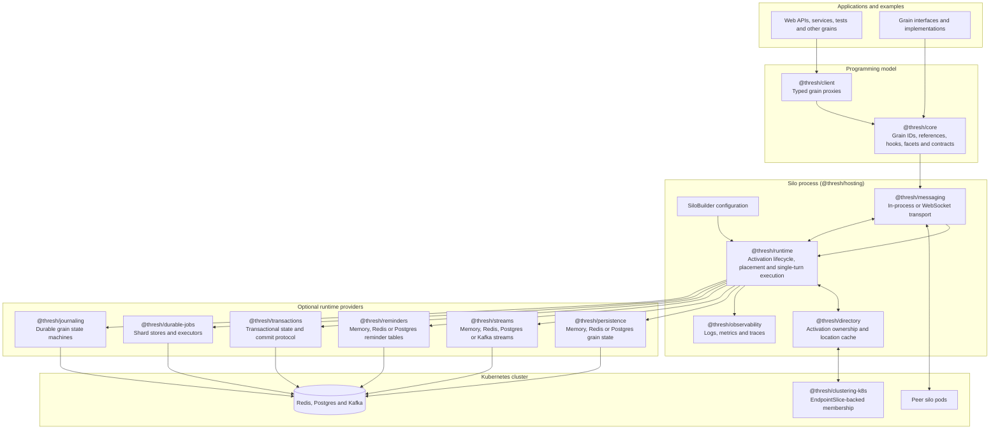

# Thresh

Thresh is a TypeScript implementation of the **virtual actor model** popularised by
[Microsoft Orleans](https://github.com/dotnet/orleans), designed to run on **Kubernetes**.

The runtime delegates cluster concerns — membership, failure detection, discovery, scaling and
rolling updates — to Kubernetes primitives instead of reimplementing Orleans' gossip and probing
machinery. What remains is the part that makes the programming model pleasant: location-transparent,
strongly-typed, single-threaded-per-actor objects with managed lifecycles.

## What is a grain?

A **grain** is a virtual actor: a uniquely identified object with behaviour and optional state that
is *always addressable*. You never create or destroy a grain — you simply obtain a reference to one
by its identity and call methods on it. The runtime activates the grain on some pod on demand,
keeps its state in memory while it is busy, processes its messages **one turn at a time** so you
never write a lock, and deactivates it when it goes idle. If a pod dies, the grain transparently
reactivates elsewhere on its next call. This is "distributed objects that just work".

## Quick example

A grain is written as a **factory closure** — the React-inspired functional style is the default.
Per-activation state lives in closure variables; durable state and other facets come from hooks on
the setup context; the returned object is the grain's message surface.

```ts
// Interface — the contract callers see. A compile-time view; no method table.
type Thermostat = GrainKey<string> & {
  onUpdate(status: ThermostatStatus): Promise<Command[]>;
};
const thermostat = defineGrainInterface<Thermostat>("Thermostat");

// Implementation — a factory closure that runs once per activation.
const ThermostatGrain = defineGrain<Thermostat>("Thermostat", (ctx) => {
  const status = usePersistentState<ThermostatStatus>(ctx, "status");

  const onUpdate = async (next: ThermostatStatus): Promise<Command[]> => {
    status.value = next;
    await status.write();
    return [];
  };

  return { onUpdate };
});

// Caller — from a web frontend or another grain.
const ref = client.getGrain(thermostat, deviceId);
const commands = await ref.onUpdate(update);
```

`client.getGrain` returns a lightweight proxy; the grain is activated on first call, wherever the
cluster decides to place it. The caller does not know — or need to know — which pod that is. The
class + decorator form this functional API is built on is still supported as an interop surface.

## Application architecture

At a high level, Thresh splits the Orleans-style virtual actor runtime into a small set of
workspace packages that can run in-process for tests and examples, or as a set of Kubernetes-hosted
silos in production. Callers use typed grain references; the runtime resolves and activates grains
on demand; optional providers add persistence, streams, reminders, transactions, durable jobs and
observability.



The core call path is intentionally location-transparent: application code asks the client for a
grain reference, messaging carries the request to the silo that owns or creates the activation, the
runtime executes the grain one turn at a time, and provider packages handle any durable state or
background work. In Kubernetes, membership and peer discovery come from EndpointSlices while Redis,
Postgres and Kafka back the durable provider implementations.

## Documentation

The documentation is published as a searchable Docsify site and in agent-friendly forms:
`docs/llms.txt` is a concise map and `docs/llms-full.txt` is generated as a single
context document. Run `pnpm docs:dev` locally or `pnpm docs:build` for the GitHub Pages artifact.

The target is **feature parity with Orleans 10**, so the model, persistence, reminders, streams and
transactions are deliberately the same as Orleans — read the Orleans source for their mechanics. The
docs cover only what is worth writing down here:

- [How this differs from Orleans](docs/deviations.md) — the deviations only (TypeScript idioms,
  Kubernetes hosting, functional authoring), each linked to its decision record.
- [TypeScript grain API idioms](docs/typescript-grain-api.md) — naming and typing guidance for
  writing grain surfaces without C#-style `I*` interfaces or key marker names.
- [`EPICS.md`](EPICS.md) — the live status board (shipped vs. remaining).

## Developing

A [pnpm](https://pnpm.io) workspace of `@thresh/*` packages. Requires Node 22+ and pnpm.

```sh
pnpm install      # install workspace dependencies
pnpm test         # run the Vitest suites
pnpm typecheck    # type-check every package
pnpm lint         # ESLint + Prettier
```

### Examples

Each example runs end-to-end over in-memory providers and the in-process transport, and is also
exercised as a smoke test in the suite so it can't rot. Start with the greeter.

```sh
pnpm --filter @thresh/example-greeter start     # core actor model: activation, turns, idle reset
pnpm --filter @thresh/example-chat start         # stream fan-out to many members + durable resume
pnpm --filter @thresh/example-cluster start      # 3 silos over WebSocket: cross-silo routing + failover
pnpm --filter @thresh/example-bank start         # reducer grains: events fold to immutable state
pnpm --filter @thresh/example-thermostat start   # durable state + a reminder + a telemetry stream
```

- [`examples/greeter`](examples/greeter) — the smallest grain: a `useOnActivate` hook runs before the
  first call, concurrent calls are serialized turns, and volatile state resets when the grain reactivates
  after going idle.
- [`examples/chat`](examples/chat) — a room fans each message out to every member; a member that
  deactivated while idle resumes *its own* durable subscription and recovers exactly what it missed.
- [`examples/cluster`](examples/cluster) — three silos over the real WebSocket transport. Calls from
  any silo route to one shared activation (directory CAS); when the hosting silo dies the grain
  reactivates on a survivor.
- [`examples/bank`](examples/bank) — reducer grains in the functional style. The account is shown two
  ways: a multi-method `defineGrain` closure with `useReducerState`, and the zero-boilerplate
  `defineReducerGrain` whose whole surface is `dispatch(action)` + `query()` with cross-grain work
  returned as Elm-style effects. Both fold a pure reducer into immutable state, persisted as a
  snapshot that survives a silo restart.
- [`examples/thermostat`](examples/thermostat) — the Orleans README example: `@persistentState`, a
  durable self-check reminder, and a telemetry stream consumed by an aggregator.

One example deploys to a real cluster rather than running in-process:

- [`examples/k8s-silo`](examples/k8s-silo) — a silo on Kubernetes: a `StatefulSet` with membership
  from the headless Service's EndpointSlices, durable state in an in-cluster Redis, and an
  HTTP-over-grain API. Its opt-in end-to-end test (`K8S_E2E=1`) deploys it and asserts the cluster
  forms, calls route to one activation across pods, a killed pod's grain reactivates on a survivor,
  and a rolling update keeps state.

Work proceeds test-first in vertical slices that map to the
[`EPICS.md`](EPICS.md) status board; [`todo.md`](todo.md) tracks outstanding items.
