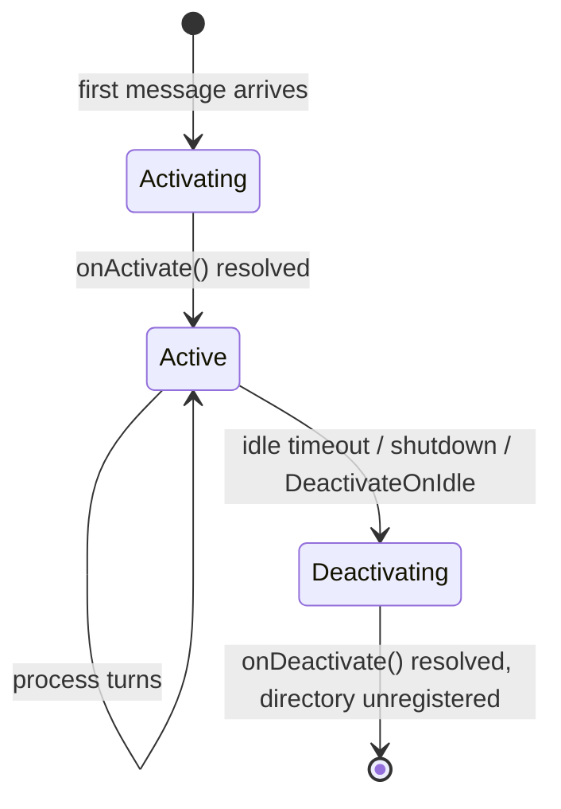

# 02 — The actor model

The developer-facing programming model: how grains are declared, identified, referenced and invoked,
and the execution guarantees the runtime provides.

> Orleans references: `Orleans.Core.Abstractions/Core/{Grain,IGrain}.cs`, `.../IDs/GrainId.cs`,
> `.../Runtime/GrainReference.cs`, `Orleans.Runtime/Catalog/ActivationData.cs`,
> `Orleans.Runtime/Scheduler/ActivationTaskScheduler.cs`.

## Grains

A grain is authored as a **factory closure** registered with `defineGrain` — the functional default
([ADR 0009](adr/0009-functional-grains.md)). The factory runs **once per activation**, captures
per-activation state in closure variables (lock-free under the single-turn model, like class fields),
and returns the grain's methods plus optional lifecycle hooks.

```ts
const CounterGrain = defineGrain<ICounter>("Counter", (ctx) => {
  let count = 0; // per-activation state captured in the closure
  return {
    increment: async (by: number) => (count += by),
    onActivate: async (reason) => { /* load state, register reminders */ },
    onDeactivate: async (reason) => { /* flush state */ },
  };
});
```

The factory receives a `GrainSetup` ctx — the identity and services a class grain reaches through
`this`, passed in explicitly, and read by the facet hooks (`usePersistentState`, `useReducerState`;
[07](07-persistence.md)): `{ id: GrainId; runtime: GrainRuntime; getGrain(def, key) }`. `onActivate`
runs before the first message; `onDeactivate` before the activation is removed; both are awaited
(mirroring Orleans' `OnActivateAsync` / `OnDeactivateAsync`).

`defineGrain` is a shell over a `Grain` base class registered with `@grain()`. That class form is
fully supported for interop or subclassing, with the same surface through `this` and overridable
`onActivate`/`onDeactivate`; every guarantee below applies to it identically, and the Orleans source
citations map onto this substrate.

## Grain identity

A `GrainId` is a `(type, key)` pair; the key is one of three kinds, mirroring Orleans'
`IGrainWithStringKey` / `IGrainWithIntegerKey` / `IGrainWithGuidKey`:

```ts
type GrainKey = string | bigint | Guid;
class GrainId { readonly type: GrainType; readonly key: GrainKey; toString(): string; } // "Counter/tenant-42"

interface ICounter extends GrainWithStringKey { increment(by: number): Promise<number>; }
```

Identity is **stable and meaningful**: `getGrain(ICounter, "tenant-42")` always refers to the same
logical grain, activated or not, regardless of which pod hosts it.

## Grain references and the proxy mechanism

A reference is a strongly-typed proxy implementing the grain interface, built at **runtime with an ES
`Proxy`** rather than a compile-time generated class ([ADR 0001](adr/0001-runtime-proxy-grain-references.md)).

An interface is a **compile-time view** of the message surface ([ADR 0011](adr/0011-message-dispatch-substrate.md)):
the TypeScript type plus the methods needing non-default invocation options. There is no method table —
calls dispatch by **method name** on the wire, so nothing is generated or hand-maintained.

```ts
const ICounter = defineGrainInterface<ICounter>("ICounter", { options: { get: { readOnly: true } } });
```

The proxy's `get` trap returns a function that builds a request envelope keyed by the accessed method
name and dispatches it (`{ target: GrainId, interfaceId, method, args, options }`). It is lightweight
and serializable — it carries only the `GrainId`, interface id, and a runtime handle — so passing a
reference to another grain serializes to just the identity and rehydrates as a proxy on the receiver.
(One reserved name: the proxy never resolves `then`, so a reference can be held or `await`ed safely.)

## Invocation options

Per-method options map directly onto Orleans `InvokeMethodOptions`:

- **default** — request/response; the call awaits a result; processed as an exclusive turn.
- **`readOnly`** — may interleave with other read-only turns on the same activation.
- **`alwaysInterleave`** — may interleave with any turn (the author asserts it is safe).
- **`oneWay`** — fire-and-forget; resolves once the message is accepted.

## Execution model: single-threaded turns

Orleans' central guarantee is that **a grain processes at most one turn at a time**, so its fields
need no locks. `await` yields the event loop, so we enforce this with a **per-activation turn
scheduler**: each activation owns a FIFO queue, and the scheduler runs one request to completion —
across all its awaited continuations — before starting the next. The whole `async` method is one
turn, so state is never observed mid-mutation. This mirrors Orleans' `ActivationTaskScheduler` +
`WorkItemGroup`.

### Reentrancy

Strict one-at-a-time execution can deadlock (A → B → A while A awaits B). Two mechanisms, both
mirroring Orleans, address it:

1. **Method-level interleaving** — `readOnly` / `alwaysInterleave` methods are admitted immediately
   rather than queued behind a running exclusive turn.
2. **Call-chain reentrancy** — a request carries a reentrancy id; a message bearing the same id as the
   call the grain is currently awaiting may be admitted, letting the chain progress
   (Orleans' `ICallChainReentrantGrainContext`).

A grain may opt into full reentrancy (all methods interleave, author owns the hazards) via
`{ reentrant: true }` on `defineGrain` or `@reentrant()` on a class.

## Activation lifecycle



Orleans models activation as an ordered lifecycle (`IGrainLifecycle`) with `SetupState` (1000) before
`Activate` (2000). We mirror the ordering: the facet hooks (`usePersistentState` / `useReducerState`,
and the transactional facet of [ADR 0008](adr/0008-cross-grain-transactions.md)) are **bound and read
at setup, before `onActivate`**, so persisted state is populated when the activation hook and first
message observe it.

- **On demand** — the first request triggers placement ([06](06-grain-directory-and-placement.md)),
  construction, `onActivate`, then message processing.
- **Automatic deactivation** — grains idle beyond a configurable collection age are collected; a grain
  may request early deactivation (`deactivateOnIdle()`) or extend its life
  (`delayDeactivation(duration)`).
- **Transparent failure** — if a silo dies its activations are lost and directory entries removed; the
  next call reactivates elsewhere. State durability is the persistence layer's job ([07](07-persistence.md)).

The developer writes a factory closure of `async` methods and an interface — no locks, threads,
connection handling, service discovery, or placement logic. The runtime supplies identity, placement,
location, single-threaded safety, lifecycle and durability.
