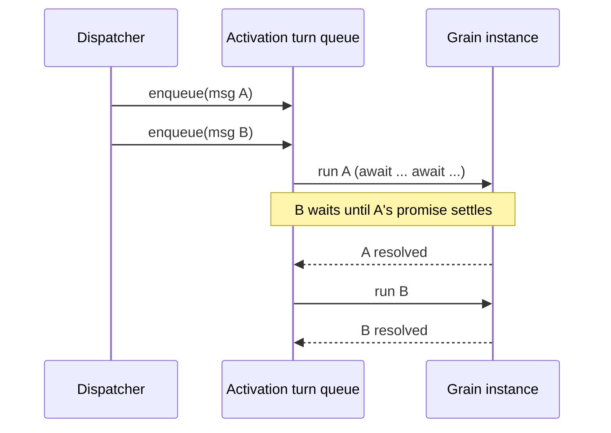
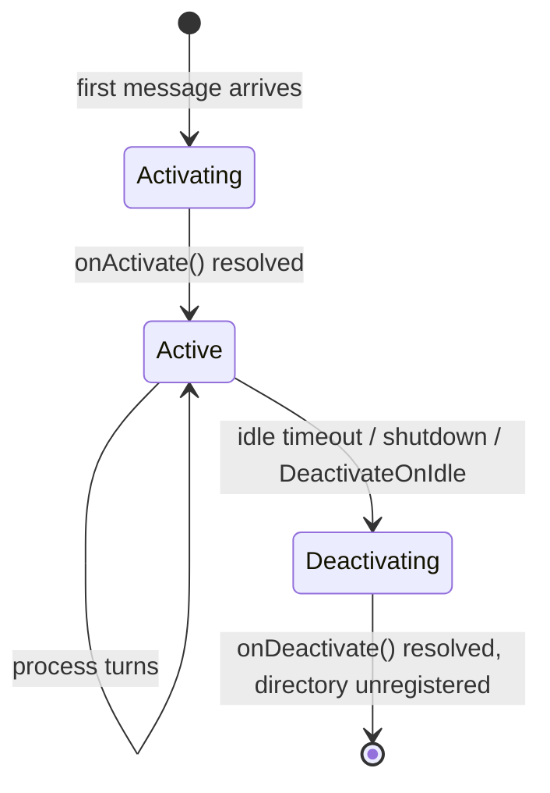

# 02 — The actor model

This document defines the developer-facing programming model: how grains are declared, identified,
referenced and invoked, and the execution guarantees the runtime provides.

> Orleans references: `Orleans.Core.Abstractions/Core/Grain.cs`,
> `Orleans.Core.Abstractions/Core/IGrain.cs`,
> `Orleans.Core.Abstractions/IDs/GrainId.cs`,
> `Orleans.Core.Abstractions/Runtime/GrainReference.cs`,
> `Orleans.Runtime/Catalog/ActivationData.cs`,
> `Orleans.Runtime/Scheduler/ActivationTaskScheduler.cs`.

## Grains

A grain is authored as a **factory closure** registered with `defineGrain`, in the React-inspired
functional style that is this project's default (see
[ADR 0009](adr/0009-functional-grains.md)). The factory runs **once per activation**; it captures
per-activation state in ordinary closure variables — lock-free under the single-turn model just like
class fields — and returns the grain's methods (its message surface) plus optional lifecycle hooks.

```ts
const CounterGrain = defineGrain<ICounter>("Counter", (ctx) => {
  let count = 0;                       // per-activation state, captured in the closure

  const increment = async (by: number): Promise<number> => {
    count += by;
    return count;
  };

  return { increment };
});
```

The factory receives a `GrainSetup` context — the same identity and services a class grain reaches
through `this`, passed in explicitly — which the facet hooks (`usePersistentState`,
`useReducerState`, see [07](07-persistence.md)) also read:

```ts
interface GrainSetup {
  readonly id: GrainId;                                            // this grain's identity
  readonly runtime: GrainRuntime;                                  // timers, reminders, streams
  getGrain<T>(def: GrainInterface<T>, key: GrainKey): T;           // call other grains
}
```

Lifecycle hooks are returned alongside the methods rather than overridden:

```ts
const SessionGrain = defineGrain<ISession>("Session", (ctx) => {
  // ... build the methods ...
  return {
    /* methods, */
    onActivate: async (reason) => { /* load state, register reminders */ },
    onDeactivate: async (reason) => { /* flush state */ },
  };
});
```

`onActivate` runs before the first message is processed; `onDeactivate` runs before the activation
is removed. Both are awaited by the runtime, so a grain can load state on activation and flush it on
deactivation. This mirrors Orleans' `OnActivateAsync` / `OnDeactivateAsync`.

### The class substrate (interop)

`defineGrain` is built on a `Grain` base class registered with the `@grain()` decorator. That class
form is fully supported — use it for interop with code that expects a class, or when subclassing
suits you better — and the rest of this document's guarantees apply to it identically:

```ts
@grain()
class CounterGrain extends Grain implements ICounter {
  private count = 0;
  async increment(by: number): Promise<number> {
    this.count += by;
    return this.count;
  }
}
```

The base exposes the same surface through `this` that `GrainSetup` exposes as `ctx` — `id`,
`runtime`, `getGrain` — and `onActivate` / `onDeactivate` are overridable methods. The Orleans source
citations throughout these docs map onto this substrate, which is unchanged; the functional API is a
shell over it.

## Grain identity

A `GrainId` is a (grain type, key) pair. The key is one of three kinds, mirroring Orleans'
`IGrainWithStringKey` / `IGrainWithIntegerKey` / `IGrainWithGuidKey`:

```ts
type GrainKey = string | bigint | Guid;

class GrainId {
  readonly type: GrainType;   // identifies the implementation, e.g. "Counter"
  readonly key: GrainKey;     // identifies the instance, e.g. "tenant-42"
  toString(): string;         // "Counter/tenant-42" — stable, serializable
}
```

Interfaces declare their key kind so the factory can enforce it at the type level:

```ts
interface ICounter extends GrainWithStringKey { increment(by: number): Promise<number>; }
interface IDevice  extends GrainWithGuidKey   { ping(): Promise<void>; }
```

Identity is **stable and meaningful**: `getGrain(ICounter, "tenant-42")` always refers to the same
logical grain, whether or not it is currently activated, and regardless of which pod hosts it.

## Grain references and the proxy mechanism

A grain reference is a strongly-typed proxy implementing the grain interface. Unlike Orleans, which
generates proxy classes at compile time, we build them at **runtime with an ES `Proxy`**.
See [ADR 0001](adr/0001-runtime-proxy-grain-references.md) for the rationale.

### Declaring an interface

A grain interface is a **compile-time view** of a grain's message surface
(see [ADR 0011](adr/0011-message-dispatch-substrate.md)): the TypeScript type plus the handful of
methods that need non-default invocation options. There is no method table — calls dispatch by
**method name** on the wire, so nothing here is generated or hand-maintained:

```ts
const ICounter = defineGrainInterface<ICounter>("ICounter", {
  options: { get: { readOnly: true } },           // per-method invocation flags only
});
```

`readOnly`, `oneWay` and `alwaysInterleave` flags map to Orleans' `InvokeMethodOptions` and control
reentrancy and response handling (see below).

### What the proxy does

`getGrain<ICounter>(ICounter, key)` returns `new Proxy({}, handler)` where the handler's `get` trap
returns a function that, when called, constructs a request envelope keyed by the accessed **method
name** and dispatches it:

```ts
// Conceptually, the proxy turns this:
await counter.increment(5);
// into this:
await runtime.invoke({
  target: new GrainId("Counter", key),
  interfaceId: ICounter.id,   // routes to the hosting type; rehydrates refs
  method: "increment",        // dispatched by name on the receiver
  args: [5],
  options: ICounter.options.increment ?? NONE,
});
```

The proxy is lightweight and serializable: it carries only the `GrainId`, the interface id and a
handle to the runtime. Passing a grain reference as an argument to another grain call serializes to
just the identity, and rehydrates as a proxy on the receiving side. (One reserved name: the proxy
never resolves `then`, so a reference can be safely held or `await`ed without dispatching a call.)

## Invocation, request envelopes and options

Every call becomes a **request** that the runtime either dispatches locally or sends to the owning
silo (see [04 — Messaging](04-messaging-and-serialization.md)). The per-method options control
semantics:

- **default** — request/response; the call awaits a result; the target processes it as an exclusive
  turn.
- **`readOnly`** — may interleave with other read-only turns on the same activation.
- **`alwaysInterleave`** — may interleave with any turn (the developer asserts the method is safe to
  run concurrently with others on the same grain).
- **`oneWay`** — fire-and-forget; resolves as soon as the message is accepted, no response is
  awaited.

These map directly onto Orleans `InvokeMethodOptions` (`OneWay`, `ReadOnly`, `AlwaysInterleave`,
`Unordered`).

## Execution model: single-threaded turns

Orleans' central safety guarantee is that **a grain processes at most one turn at a time**, so a
grain's fields need no locks. Node.js is single-threaded at the event-loop level, but `await` yields
the loop, so two messages to the same grain could otherwise interleave arbitrarily. We therefore
enforce the guarantee explicitly with a **per-activation turn scheduler**.



Each activation owns a FIFO queue. The scheduler runs one request to completion — including all of
its awaited continuations — before starting the next. Because the entire `async` method (across all
its `await` points) is treated as a single turn, the grain's state is never observed mid-mutation by
another request.

This mirrors Orleans' `ActivationTaskScheduler` + `WorkItemGroup`: in Orleans a custom
`TaskScheduler` pins all continuations of a grain's turn to that grain's single-threaded work group;
here a promise queue serialises whole `async` invocations per activation.

### Reentrancy

Strict one-at-a-time execution can deadlock: if grain A calls grain B which calls back into A while
A is still awaiting B, A's second turn would wait forever behind the first. The model addresses this
two ways, both mirroring Orleans:

1. **Method-level interleaving.** Methods marked `readOnly` or `alwaysInterleave` are allowed to run
   concurrently with other turns on the same activation. The turn scheduler admits them immediately
   instead of queuing them behind a running exclusive turn.
2. **Call-chain reentrancy.** A request carries a reentrancy id for its call chain. When a grain is
   awaiting an outbound call and a message arrives bearing the same call-chain id, the scheduler may
   admit it, allowing the chain to make progress. (Orleans:
   `ICallChainReentrantGrainContext`.)

A grain may also opt into full reentrancy — all its methods may interleave, and the author takes
responsibility for shared-state hazards across `await`: pass `{ reentrant: true }` to `defineGrain`,
or apply `@reentrant()` to a class grain.

## Activation lifecycle



Orleans models activation as an ordered **lifecycle** (`IGrainLifecycle`) whose participants observe
named stages — principally `SetupState` (1000) then `Activate` (2000), per
`Orleans.Core.Abstractions/Runtime/GrainLifecycleStage.cs`. We mirror this ordering: the facet
hooks (`usePersistentState` / `useReducerState`, and the transactional-state facet of
[ADR 0008](adr/0008-cross-grain-transactions.md)) are **bound and read at the setup stage, before
`onActivate` runs**, so a grain's persisted state is already populated when the activation hook —
and the first message — observes it. The diagram's `Activating` spans both stages; `onActivate`
is the `Activate` stage.

- **Activation is on demand.** The first request for a grain triggers placement
  (see [06](06-grain-directory-and-placement.md)), construction of the instance, the `onActivate`
  hook, then message processing.
- **Deactivation is automatic.** Grains idle beyond a configurable collection age are deactivated to
  free memory. A grain can request early deactivation (`runtime.deactivateOnIdle()`) or extend its
  life (`runtime.delayDeactivation(duration)`), mirroring Orleans' `DeactivateOnIdle` /
  `DelayDeactivation`.
- **Failure is transparent.** If a silo dies, its activations are lost and their directory entries
  are removed; the next call reactivates the grain elsewhere. State durability is the persistence
  layer's responsibility, not the activation's (see [07](07-persistence.md)).

## What the developer never writes

No locks, no thread management, no connection handling, no service discovery, no "where does this
object live" logic. They write a factory closure returning `async` methods, and an interface. The
runtime supplies identity, placement, location, single-threaded safety, lifecycle and durability.
