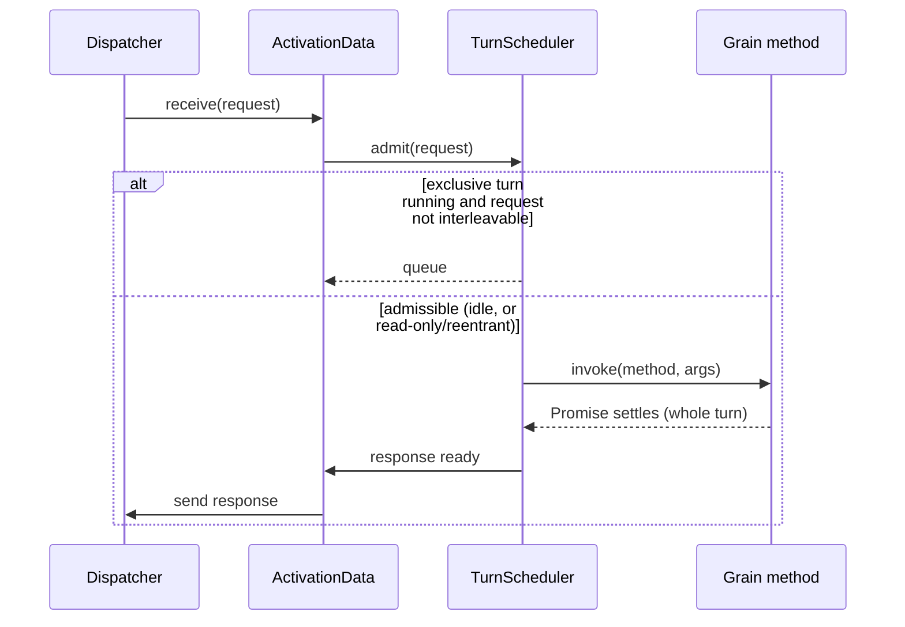
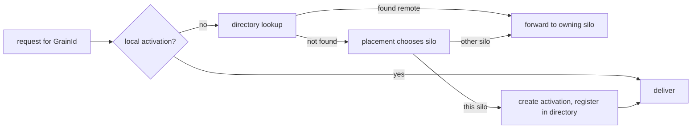

# 03 — Runtime and silo

The **silo** is the runtime host process: one silo per Kubernetes pod. It hosts many grain
activations and provides them with the services described in the actor model. This document
describes the silo's internal composition and the path a message takes through it.

> Orleans references: `Orleans.Runtime/Catalog/ActivationData.cs`,
> `Orleans.Runtime/Catalog/Catalog.cs`,
> `Orleans.Runtime/Scheduler/ActivationTaskScheduler.cs`,
> `Orleans.Runtime/Messaging/MessageCenter.cs`,
> `Orleans.Runtime/Core/GrainRuntime.cs`.

## Silo composition

```mermaid
flowchart TB
    subgraph Silo (one per pod)
      MC[Message dispatcher]
      CAT[Catalog: activations]
      SCH[Per-activation turn schedulers]
      DIR[Directory partition]
      PLC[Placement service]
      MEM[Membership view]
      PER[Persistence runtime]
      TIM[Timer service]
      REM[Reminder service]
      STR[Stream runtime]
    end
    NET[(WebSocket transport)] --- MC
    MC --> CAT
    CAT --> SCH
    MC --> DIR
    MC --> PLC
    MEM --> DIR
    MEM --> PLC
    CAT --> PER
    CAT --> TIM
    REM --> CAT
    STR --> CAT
```

The silo owns:

- **Message dispatcher** — accepts inbound messages from the transport, routes requests to local
  activations or forwards to remote silos, and matches responses to awaiting callers via a
  correlation table. See [04](04-messaging-and-serialization.md).
- **Catalog** — the registry of live activations on this silo, keyed by `GrainId`. Responsible for
  creating, tracking and collecting activations. Mirrors Orleans `Catalog`.
- **Turn schedulers** — one FIFO scheduler per activation, enforcing single-threaded turns
  (see [02](02-actor-model.md)).
- **Directory partition** — this silo's slice of the distributed grain directory.
  See [06](06-grain-directory-and-placement.md).
- **Placement service** — decides where new activations go.
- **Membership view** — the live silo set from Kubernetes. See [05](05-clustering-membership-k8s.md).
- **Persistence / timers / reminders / streams** — the runtime services grains consume.

## Activation data

Each activation is represented by an `ActivationData`, the runtime's per-grain bookkeeping object
(Orleans uses the same name). It is also the grain's `GrainContext`.

```ts
class ActivationData implements GrainContext {
  readonly id: GrainId;
  readonly activationId: ActivationId;   // unique per incarnation
  instance: Grain;                        // the user's grain object
  state: "activating" | "active" | "deactivating" | "invalid";
  readonly scheduler: TurnScheduler;      // serialises this grain's turns
  readonly inbox: RequestMessage[];       // queued, pending admission

  receive(message: Message): void;        // dispatch entry point
  deactivate(reason: DeactivationReason): Promise<void>;
}
```

`receive` is the single entry point for messages targeting this grain. Responses are matched against
the correlation table; requests are admitted to the turn scheduler subject to reentrancy rules.

## The message loop and turn admission



Admission rules (mirroring Orleans reentrancy):

- If no turn is running, admit immediately.
- If an exclusive turn is running, queue — unless the incoming request is `readOnly` (and the
  running turn is also read-only-compatible), `alwaysInterleave`, the grain is `@reentrant`, or the
  request shares the running turn's call-chain reentrancy id.

A turn is the *entire* `async` method execution, including continuations after each `await`. The
scheduler does not start the next exclusive turn until the current one's promise settles.

## Activation creation and placement

When the dispatcher receives a request for a `GrainId` with no local activation:



Creation is **race-safe**: the directory `register` is a compare-and-set, so two silos that
concurrently try to activate the same grain converge on a single winner; the loser forwards to the
winner. See [06](06-grain-directory-and-placement.md).

## Grain runtime services

The `GrainRuntime` is what a grain reaches through `this.runtime`. It exposes the per-activation
services, mirroring Orleans `IGrainRuntime`:

```ts
interface GrainRuntime {
  readonly siloAddress: SiloAddress;
  getGrain<T>(def: GrainInterface<T>, key: GrainKey): T;      // grain factory
  getStorage<TState>(name: string): PersistentState<TState>;  // see 07
  registerTimer(cb: () => Promise<void>, due: Duration, period?: Duration): GrainTimer; // see 08
  deactivateOnIdle(): void;
  delayDeactivation(by: Duration): void;
  getStreamProvider(name?: string): StreamProvider;           // see 09
}
```

These are resolved per activation so that calls made from inside a grain method carry the correct
ambient context (the calling grain's identity, the request context, the current turn).

## Graceful shutdown

On `SIGTERM` (Kubernetes sending the pod to termination), the silo:

1. Marks itself draining and stops accepting new placements (it leaves the placement candidate set).
2. Lets in-flight turns finish, up to the pod's `terminationGracePeriodSeconds`.
3. Deactivates its activations, awaiting each `onDeactivate` (so state is flushed).
4. Hands off its directory partition / unregisters its entries so callers re-resolve elsewhere.
5. Closes transport connections and exits.

The Kubernetes hosting model and probe wiring that drive this are in
[10 — Kubernetes hosting](10-kubernetes-hosting.md).
