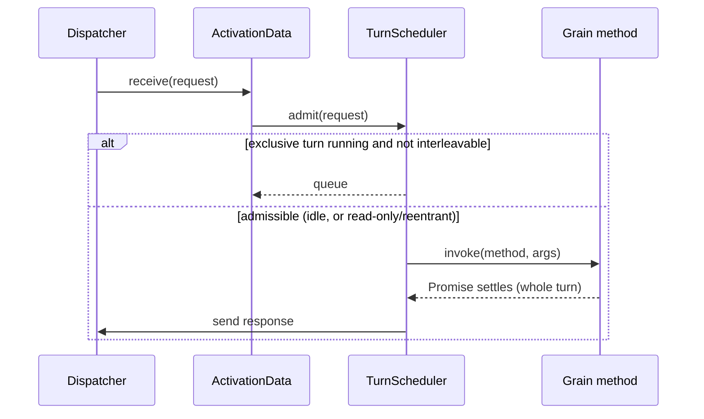

# 03 — Runtime and silo

The **silo** is the runtime host process — one per Kubernetes pod. It hosts many grain activations and
provides their services. This doc covers the silo's composition and the path a message takes through it.

> Orleans references: `Orleans.Runtime/Catalog/{ActivationData,Catalog}.cs`,
> `Orleans.Runtime/Scheduler/ActivationTaskScheduler.cs`,
> `Orleans.Runtime/Messaging/MessageCenter.cs`, `Orleans.Runtime/Core/GrainRuntime.cs`.

## Silo composition

```mermaid
flowchart TB
    subgraph Silo (one per pod)
      MC[Message dispatcher]
      CAT[Catalog: activations]
      SCH[Per-activation turn schedulers]
      DIR[Directory partition]
      PLC[Placement service]
      MEM[Membership view]
      PER[Persistence / timers / reminders / streams]
    end
    NET[(WebSocket transport)] --- MC
    MC --> CAT --> SCH
    MC --> DIR
    MC --> PLC
    MEM --> DIR
    MEM --> PLC
    CAT --> PER
```

- **Message dispatcher** — accepts inbound messages, routes requests to local activations or forwards
  to remote silos, and matches responses to awaiting callers via a correlation table ([04](04-messaging-and-serialization.md)).
- **Catalog** — the registry of live activations keyed by `GrainId`; creates, tracks and collects them
  (Orleans' `Catalog`).
- **Turn schedulers** — one FIFO scheduler per activation, enforcing single-threaded turns ([02](02-actor-model.md)).
- **Directory partition / placement / membership** — this silo's directory slice, where new
  activations go, and the live silo set ([05](05-clustering-membership-k8s.md), [06](06-grain-directory-and-placement.md)).
- **Persistence / timers / reminders / streams** — the runtime services grains consume.

## Activation data

Each activation is an `ActivationData` — the runtime's per-grain bookkeeping object and the grain's
`GrainContext` (Orleans' `IGrainContext`): `{ id, activationId, instance, state, scheduler, … }`.
`receive(message)` is the single entry point; responses match the correlation table, requests are
admitted to the scheduler subject to reentrancy rules.

It owns the grain's **ordered lifecycle** (`SetupState` → `Activate`; [02](02-actor-model.md)) and
hosts **registered components/extensions** — system targets reachable on the activation alongside the
user's methods (Orleans' `SetComponent`/`GetComponent`): the `StreamConsumer` and `BroadcastConsumer`
delivery extensions and the transactional resource/manager of [ADR 0008](adr/0008-cross-grain-transactions.md)
are bound this way. **Grain call filters** (incoming/outgoing interception) wrap method dispatch here
([ADR 0012](adr/0012-grain-call-filters.md)).

## The message loop and turn admission



Admission (mirroring Orleans reentrancy): admit immediately if no turn is running; if an exclusive
turn is running, queue — unless the request is `readOnly` (and the running turn is read-only-compatible),
`alwaysInterleave`, the grain is `@reentrant`, or it shares the running turn's call-chain reentrancy
id. A turn is the *entire* `async` method execution including continuations; the scheduler doesn't
start the next exclusive turn until the current promise settles.

## Activation creation

For a request whose `GrainId` has no local activation: look up the directory; forward if it lives
remotely; else placement chooses a silo and, if it's this one, create the activation and register it.
Creation is **race-safe** — the directory `register` is compare-and-set, so concurrent activators
converge on one winner and the loser forwards ([06](06-grain-directory-and-placement.md)).

## Grain runtime services

`GrainRuntime` (reached as `this.runtime`) exposes per-activation services, mirroring Orleans
`IGrainRuntime`: `getGrain`, `registerTimer`, `registerReminder` / `unregisterReminder` (08),
`getStreamProvider` (09), `getBroadcastChannelProvider`, `deactivateOnIdle`, `delayDeactivation`,
`migrateOnIdle`. (Persistent state is acquired through the `usePersistentState` hook / `@persistentState`
decorator, not a runtime accessor; 07.) These resolve per activation so calls made inside a method
carry the correct ambient context (the caller's identity, request context, current turn).

## Graceful shutdown

On `SIGTERM` the silo: (1) marks itself draining and leaves the placement candidate set; (2) lets
in-flight turns finish up to `terminationGracePeriodSeconds`; (3) deactivates activations, awaiting
each `onDeactivate` so state flushes; (4) hands off / unregisters its directory entries so callers
re-resolve; (5) closes transport and exits. The probe wiring that drives this is in
[10 — Kubernetes hosting](10-kubernetes-hosting.md).
