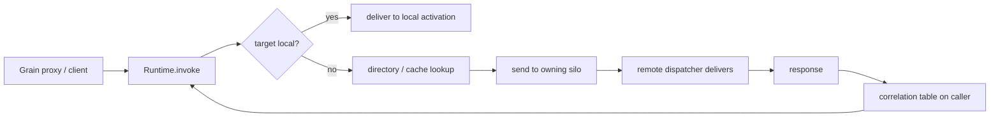

# 04 — Messaging and serialization

How a grain call becomes bytes on a connection and back, how silos communicate, and how payloads are
serialized.

> Orleans references: `Orleans.Core/Messaging/Message.cs`,
> `Orleans.Core/Networking/{Connection,ConnectionPreamble}.cs`,
> `Orleans.Core.Abstractions/Runtime/RequestContext.cs`, `Orleans.Serialization/Serializer.cs`.

## The message envelope

Every call and result is carried in a `Message`, following Orleans' `Message` closely:

```ts
interface Message {
  correlationId: bigint;          // matches a response to its awaiting request
  direction: "request" | "response" | "oneWay";
  targetGrain: GrainId;
  targetSilo?: SiloAddress;       // resolved via the directory before sending
  sendingGrain?: GrainId;
  sendingSilo?: SiloAddress;
  interfaceId: number;            // routes to the hosting type; rehydrates refs
  method: string;                 // dispatched by name on the receiver
  system?: "directory" | "migration" | "manifest" | "load" | "rebalance"; // system ops reuse the envelope
  responseKind?: "success" | "error" | "rejection";
  requestContext?: RequestContext;// ambient headers/trace, propagated across calls
  body: Uint8Array;               // serialized args (request) or result/error (response)
}
```

- **Methods dispatch by name** — the wire carries `method`; `interfaceId` only routes to the hosting
  type and rehydrates references ([ADR 0011](adr/0011-message-dispatch-substrate.md)).
- **`targetSilo` is resolved before sending** via the directory/cache, else placement
  ([06](06-grain-directory-and-placement.md)).
- **`requestContext` is ambient** — an async-scoped value (Node's `AsyncLocalStorage`, the analogue of
  Orleans' `AsyncLocal`-backed `RequestContext`), not a parameter. The proxy reads it when building an
  outbound request, the dispatcher serializes it, and the receiver re-establishes it before invoking —
  so trace ids, deadlines, the call-chain reentrancy id, and the transaction context of
  [ADR 0008](adr/0008-cross-grain-transactions.md) flow across silos transparently.
- **System operations reuse the envelope** — directory, migration, manifest, load and rebalance ops
  travel over the same connections and correlation table as grain calls, so no separate channel is
  needed.

## Transport

Silo-to-silo and client-to-silo traffic uses **WebSocket over HTTP** ([ADR 0002](adr/0002-websocket-transport.md)),
behind an abstraction so gRPC or raw TCP could be substituted.

```ts
interface Transport {
  listen(address: SiloAddress, onMessage: (m: Message) => void): Promise<Listener>;
  connect(to: SiloAddress, preamble: ConnectionPreamble): Promise<Connection>;
}
interface Connection { send(message: Message): void; close(reason?: string): Promise<void>; }
```

Connections are lazy and pooled per peer in a `ConnectionManager` (reconnecting on transient failure);
responses travel back over a reverse connection and are multiplexed by `correlationId`. On connect each
side sends a preamble (`{ protocolVersion, siloAddress, clusterId }`, Orleans' `ConnectionPreamble`)
which the server acks; a mismatched `clusterId` or `protocolVersion` is rejected before any message
flows. WebSocket provides framing, so each binary message carries exactly one serialized `Message`
(a header segment plus the `body`), opaque to the transport.

## Routing



The caller registers a pending promise in a **correlation table** keyed by `correlationId`, sends the
request, and resolves it when the matching response arrives. Timeouts, deadline cancellation, and
rejections reject the promise with a typed error.

## Serialization

Payloads (`body`) are produced by a pluggable `Serializer` (`serialize` / `deserialize<T>`):

- **Default: MessagePack** — compact and fast; a **JSON** option aids debugging.
- **Known-type registry** — classes that travel on the wire (grain state, DTOs, custom errors) opt in
  via `@serializable()` (or explicit registration) that records field order/tags for
  forward/backward compatibility — the TypeScript analogue of Orleans' `[GenerateSerializer]` /
  `[Id(n)]`, done by runtime registration rather than build-time generation.
- **Grain references serialize to identity** (`GrainId` + interface id); the receiver rehydrates a
  proxy bound to the local runtime.

We keep Orleans' serializer *properties* (tag-based versioning, pluggable backends, grain-reference
handling) without build-time codegen, consistent with [ADR 0001](adr/0001-runtime-proxy-grain-references.md).

## Errors and rejections

- **Application errors** thrown by a method are re-thrown at the caller as the same type (when
  registered) or a generic `GrainCallError`.
- **Rejections** are runtime refusals (unknown grain type, silo draining, overload, deserialization
  failure) — a `RejectionError` whose `kind` the caller can inspect to decide whether to retry.
- **Transient delivery failures** surface as a retriable error.
