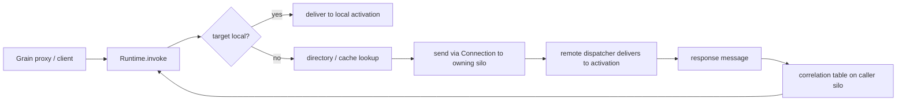

# 04 — Messaging and serialization

This document describes how a grain call becomes bytes on a connection and back, how silos
communicate, and how payloads are serialized.

> Orleans references: `Orleans.Core/Messaging/Message.cs`,
> `Orleans.Core/Networking/Connection.cs`,
> `Orleans.Core/Networking/ConnectionPreamble.cs`,
> `Orleans.Runtime/Messaging/MessageCenter.cs`,
> `Orleans.Serialization/Serializer.cs`.

## The message envelope

Every grain call and result is carried in a `Message`. The shape follows Orleans' `Message` closely.

```ts
type Direction = "request" | "response" | "oneWay";
type ResponseKind = "success" | "error" | "rejection";

interface Message {
  correlationId: bigint;          // matches a response to its awaiting request
  direction: Direction;

  targetGrain: GrainId;
  targetSilo?: SiloAddress;       // resolved via the directory before sending
  sendingGrain?: GrainId;         // absent for external-client calls
  sendingSilo?: SiloAddress;

  interfaceId: number;            // which grain interface
  methodId: number;               // which method (index into the method table)

  responseKind?: ResponseKind;    // responses only
  requestContext?: RequestContext;// ambient headers/trace, propagated across calls

  body: Uint8Array;               // serialized args (request) or result/error (response)
}
```

Key points:

- **Method identity is numeric.** `interfaceId` + `methodId` decouple the wire format from method
  names (see the method table in [02](02-actor-model.md)).
- **`targetSilo` is resolved before sending.** The dispatcher consults the grain directory/cache to
  find the owning silo; if unknown, placement decides. See [06](06-grain-directory-and-placement.md).
- **`requestContext` propagates ambient data** (trace ids, deadlines, custom headers) along the
  entire call chain, mirroring Orleans `RequestContext`. It also carries the call-chain reentrancy
  id used by the turn scheduler.

## Transport

Silo-to-silo and client-to-silo traffic uses **WebSocket over HTTP** (see
[ADR 0002](adr/0002-websocket-transport.md)). The transport is abstracted so gRPC or raw TCP could
be substituted later.

```ts
interface Transport {
  listen(address: SiloAddress, onMessage: (m: Message) => void): Promise<Listener>;
  connect(to: SiloAddress): Promise<Connection>;
}

interface Connection {
  send(message: Message): void;     // fire-and-forget; responses arrive as inbound messages
  close(reason?: string): Promise<void>;
}
```

### Connection model

- **One duplex WebSocket per silo pair**, reused for all traffic between them, multiplexed by
  `correlationId`. This avoids per-call connection setup and head-of-line blocking across grains.
  The current implementation opens one client→server socket per direction (responses travel back
  over the reverse connection) and pools them in a `ConnectionManager`; collapsing each pair onto a
  single reused duplex socket is a later optimization. The preamble is exchanged on connect and the
  server acks it, so a cross-`clusterId` peer is rejected before any message flows.
- **Lazy and pooled.** Connections open on first use and are kept alive; a `ConnectionManager`
  tracks outbound/inbound connections per peer and reconnects on transient failure.
- **Preamble handshake.** On connect, each side sends a preamble identifying itself, mirroring
  Orleans `ConnectionPreamble`:

  ```ts
  interface ConnectionPreamble {
    protocolVersion: number;
    siloAddress: SiloAddress;   // or a client identity for external clients
    clusterId: string;          // rejects cross-cluster connections
  }
  ```

  A mismatched `clusterId` or incompatible `protocolVersion` causes the connection to be rejected.

### Framing

WebSocket already provides message framing, so we do not reimplement Orleans' 8-byte length-prefix
header. Each WebSocket binary message carries exactly one serialized `Message`: a short header
segment (envelope metadata) followed by the `body` bytes. The serializer decides the internal
layout; the transport treats it as opaque.

## Routing



The caller's runtime registers a pending promise in a **correlation table** keyed by
`correlationId`, sends the request, and resolves the promise when the matching response arrives.
Timeouts, cancellation (via request-context deadlines) and rejections (e.g. silo overloaded or
unknown target) reject the pending promise with a typed error.

## Serialization

Payloads (`body`) are produced by a pluggable `Serializer`.

```ts
interface Serializer {
  serialize(value: unknown): Uint8Array;
  deserialize<T>(bytes: Uint8Array): T;
}
```

- **Default: MessagePack.** Compact and fast, with good TypeScript support. Used for grain method
  arguments, results, and grain state.
- **JSON option** for debugging and human-readable transports.
- **Known-type registry.** Classes that travel on the wire (grain state, DTOs, custom errors) are
  registered with a stable type tag so the deserializer can reconstruct instances rather than plain
  objects. This is the TypeScript analogue of Orleans' `[GenerateSerializer]` + `[Id(n)]`: instead
  of source-generated codecs, types opt in via a `@serializable()` decorator (or explicit
  registration) that records field order/tags for forward/backward compatibility.
- **Grain references serialize to identity.** A `GrainReference` on the wire is just its `GrainId` +
  interface id; the receiver rehydrates it as a proxy bound to the local runtime.

Orleans' serializer is a code-generated, versioned codec system. We keep the same *properties*
(versioning via stable field tags, pluggable backends, special handling for grain references) but
implement them with runtime registration rather than build-time generation, consistent with the
proxy approach in [ADR 0001](adr/0001-runtime-proxy-grain-references.md).

## Errors and rejections

- **Application errors** thrown by a grain method are serialized and re-thrown at the caller as the
  same error type (when registered) or a generic `GrainCallError` carrying message and stack.
- **Rejections** are runtime-level refusals (unknown grain type, silo draining, overload,
  deserialization failure). They reject the caller's promise with a `RejectionError` whose kind the
  caller can inspect to decide whether to retry.
- **Transient delivery failures** (connection dropped mid-call) surface as a retriable error;
  whether the runtime auto-retries depends on the method's idempotency declaration and is documented
  in [11 — Public API](11-public-api-and-examples.md).
