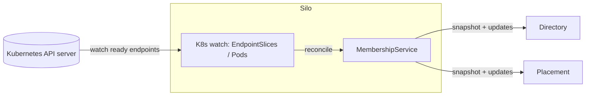

# 05 — Clustering and membership on Kubernetes

A cluster is the set of silos cooperating to host one application's grains. The hard parts of
clustering — who is alive, how to find each other, how to detect failure — are delegated to
Kubernetes. This document describes how.

> Orleans references: `Orleans.Runtime/MembershipService/*`,
> `Orleans.Core/SystemTargetInterfaces/IMembershipTable.cs`,
> `Orleans.Core/Runtime/SiloStatus.cs`,
> `Orleans.Hosting.Kubernetes/KubernetesClusterAgent.cs` (Orleans' own K8s integration).

## What we delegate to Kubernetes, and why

Orleans maintains its own membership: silos write to a pluggable membership table, gossip status
changes, and probe each other in an expander-graph topology to detect failures. That machinery
exists because Orleans must run anywhere, including bare metal with no orchestrator.

On Kubernetes, the orchestrator already provides:

- **Stable identity** — each pod in a `StatefulSet` has a stable ordinal name and DNS record.
- **Health checking** — liveness/readiness probes run continuously.
- **Discovery** — a headless `Service` exposes the set of ready pods as DNS endpoints.
- **Reconciliation** — failed pods are restarted or replaced; the endpoint set is updated.

So we let Kubernetes be the membership authority and read the live silo set from it, rather than
running our own failure detector. This is the same direction Orleans' own
`Orleans.Hosting.Kubernetes` package takes, where a `KubernetesClusterAgent` reconciles Orleans
membership against pod state and kills orphaned silos.

## Silo identity

A silo's identity derives from its pod, so no generation counter is needed (Orleans uses
`IP:port:generation` to distinguish incarnations; the pod UID already does this):

```ts
interface SiloAddress {
  podName: string;        // stable StatefulSet ordinal name, e.g. "silo-2"
  podUid: string;         // unique per incarnation; changes when the pod is recreated
  endpoint: string;       // host:port reachable via the headless Service DNS
}
```

`podName` is stable across restarts (useful for the directory ring); `podUid` distinguishes a fresh
incarnation from a previous one at the same name, so stale directory entries from a dead pod are
recognised and discarded.

## The membership service

```ts
interface MembershipService {
  current(): MembershipSnapshot;                 // current live silo set + version
  updates(): AsyncIterable<MembershipSnapshot>;  // pushed on every change
  localSilo(): SiloAddress;
}

interface MembershipSnapshot {
  version: number;                 // monotonically increasing view number
  silos: ReadonlyArray<SiloMember>;
}

interface SiloMember {
  address: SiloAddress;
  status: "joining" | "active" | "draining" | "dead";
}
```

The snapshot's `version` is the **view number**. Both the grain directory and placement key their
decisions off it; when the view changes, the directory rebalances its ring and placement updates its
candidate set. This mirrors the role of Orleans' `ClusterMembershipSnapshot` and
`MembershipVersion`.

## How membership is derived from Kubernetes



1. The silo authenticates to the Kubernetes API with its pod `ServiceAccount` (RBAC scoped to
   *watch* pods/endpoints in its own namespace — see [10](10-kubernetes-hosting.md)).
2. It **watches the EndpointSlices** of the headless `Service` selecting the silo `StatefulSet`,
   filtered by the cluster's label selector (`app=<cluster>`).
3. Ready endpoints become `active` silos; endpoints that disappear (probe failure, termination,
   crash) are removed and their silos marked `dead`.
4. Each reconciliation produces a new `MembershipSnapshot` with an incremented version, pushed to
   subscribers.

Because every silo watches the same source of truth (the API server), the views converge without a
gossip protocol. The API server's watch stream is the push mechanism Orleans gets from gossip.

## Failure detection

A silo is considered failed when **Kubernetes removes it from the ready endpoint set**, which
happens when:

- its **liveness probe** fails and the kubelet restarts the container (new `podUid`), or
- its **readiness probe** fails and it is removed from endpoints, or
- the pod is deleted/evicted/terminated.

There is no separate Orleans-style probe graph. The liveness/readiness endpoints the silo exposes
(see [10](10-kubernetes-hosting.md)) report: process up, transport accepting connections, membership
watch healthy, and not over capacity. When a silo is removed from membership, every other silo:

- drops cached directory entries pointing at it,
- removes it as a placement candidate,
- and rebuilds the affected directory ranges (see [06](06-grain-directory-and-placement.md)).

### Split-brain considerations

Kubernetes EndpointSlices are eventually consistent. Two silos may briefly disagree about whether a
third is alive. The directory's compare-and-set registration and `podUid` checks make this safe:
duplicate activations converge to one winner, and messages addressed to a dead `podUid` are rejected
so the caller re-resolves. We do not attempt stronger consensus; the cost of a brief duplicate
activation is a single redundant turn, not data corruption (state durability is the persistence
layer's job — see [07](07-persistence.md)).

## Joining and leaving

- **Join.** A new pod starts, opens its transport, begins watching membership, marks itself
  `joining`, then `active` once it is ready to accept placements. It announces nothing to peers;
  they learn of it through their own watch.
- **Leave (graceful).** On `SIGTERM` the silo marks itself `draining` (removed from placement
  candidates), finishes in-flight turns, deactivates grains (flushing state), unregisters its
  directory entries, and exits. Readiness flips to not-ready first, so Kubernetes pulls it from
  endpoints. See the shutdown sequence in [03](03-runtime-and-silo.md).
- **Leave (crash).** No cleanup runs; peers detect the endpoint removal and rebuild affected ranges.
