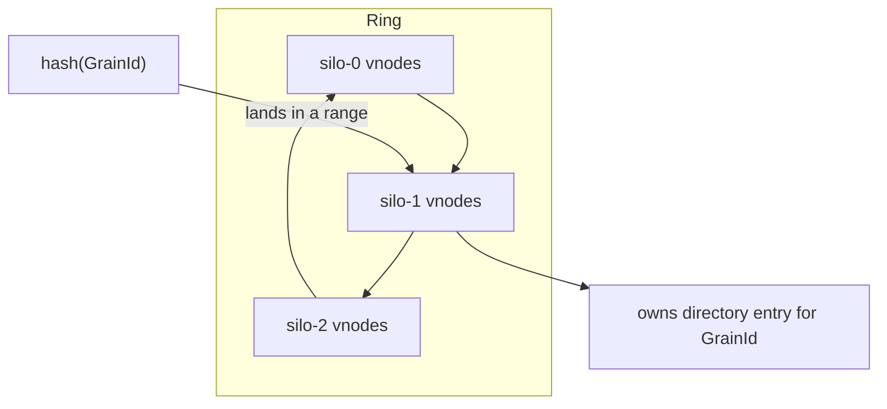
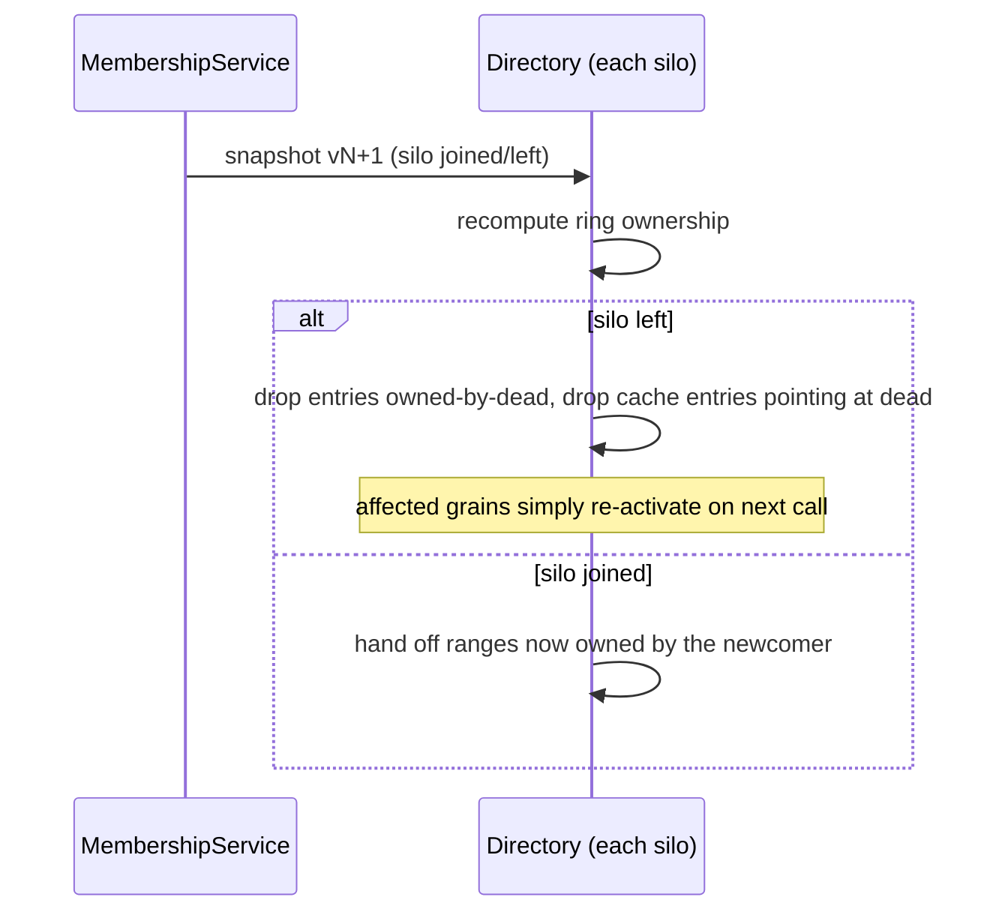
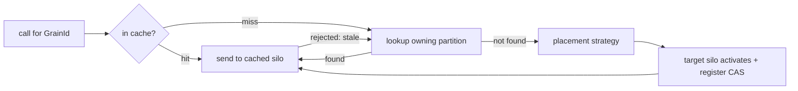

# 06 — Grain directory and placement

Two related questions the runtime must answer for every call:

- **Directory:** *where is the activation for this `GrainId` right now?*
- **Placement:** *if it has no activation, which silo should create one?*

These remain application-level concerns even on Kubernetes, because they are about *grains*, not
pods. We implement the directory as an **in-silo distributed hash table** over a consistent-hash
ring — the same design as Orleans — built on top of the Kubernetes-derived membership view from
[05](05-clustering-membership-k8s.md).

> Orleans references: `Orleans.Runtime/GrainDirectory/DistributedGrainDirectory.cs`,
> `Orleans.Runtime/GrainDirectory/GrainLocator.cs`,
> `Orleans.Runtime/GrainDirectory/DhtGrainLocator.cs`,
> `Orleans.Core.Abstractions/GrainDirectory/IGrainDirectory.cs`,
> `Orleans.Runtime/Placement/*`.

## Why a distributed directory and not an external store

Grain-location entries are **ephemeral**: an entry says "grain X is currently activated on silo Y".
If silo Y dies, the entry is meaningless and must be discarded; the grain simply reactivates
elsewhere. Because the entries are disposable and reconstructable, there is no need for a durable
external store (Redis, a database). Instead each silo owns a partition of the directory in memory,
and partitions are rebalanced when membership changes. This is faithful to Orleans and avoids
coupling the hot path to an external dependency. See
[ADR 0003](adr/0003-in-silo-dht-directory.md).

(Contrast with [07 persistence](07-persistence.md), [08 reminders](08-timers-and-reminders.md) and
[09 streams](09-event-streams.md), which *are* durable and therefore *do* use external stores,
defaulting to Redis.)

## The consistent-hash ring



- The hash space is a ring. Each silo owns a number of **virtual nodes** (ranges) spread around the
  ring, so ownership is balanced and a join/leave only reshuffles a fraction of the space (Orleans
  uses 30 virtual partitions per silo by default). This implementation places ~100 virtual nodes per
  silo, hashing both vnodes and grain ids with an FNV-1a digest plus a MurmurHash3 finalizer for the
  avalanche that even distribution depends on.
- `hash(GrainId)` maps a grain to a point on the ring; the silo owning that range is the
  **directory owner** for that grain and holds its `GrainAddress`.

```ts
interface GrainAddress {
  grainId: GrainId;
  silo: SiloAddress;       // where the activation lives
  activationId: ActivationId;
}
```

The ring is derived purely from the current `MembershipSnapshot` (the set of live silos and their
stable `podName`s). Every silo computes the same ring from the same snapshot version, so they agree
on owners without coordination.

## Directory operations

```ts
interface GrainDirectory {
  lookup(grainId: GrainId): Promise<GrainAddress | undefined>;
  register(addr: GrainAddress, previous?: GrainAddress): Promise<GrainAddress>; // CAS; returns winner
  unregister(addr: GrainAddress): Promise<void>;
  unregisterSilo(silo: SiloAddress): Promise<void>;                            // bulk on failure
}
```

- **`register` is compare-and-set.** When a silo activates a grain it registers the address with the
  owning partition. If an entry already exists (another silo won the race), the existing winner is
  returned and the loser abandons its activation and forwards instead. This is how at-most-one
  activation is preserved.
- **`lookup`** returns the current address or `undefined` (meaning "not activated anywhere — place
  it"). Most lookups are served from cache (below); only misses hit the owning partition.

## Location cache and invalidation

A directory lookup that crossed the network on every call would defeat the point. Each silo keeps a
**read-through cache** of `GrainId -> GrainAddress`, mirroring Orleans' `GrainLocator` cache:

- Populated on lookup and on successful sends.
- Invalidated when a message to a cached address is rejected ("no such activation" / wrong
  `podUid`), or when the membership view changes such that the cached silo is gone.
- Responses can piggyback **cache-invalidation hints** (Orleans does this via
  `GrainAddressCacheUpdate`) so a caller learns about a moved grain without a separate lookup.

## Rebalancing on membership change



- **On leave/crash:** entries the dead silo *owned* are lost (acceptable — they were ephemeral), and
  entries *pointing at* the dead silo are removed everywhere. Affected grains reactivate on next
  call.
- **On join:** the newcomer takes over ranges from its ring neighbours. The previous owners hand off
  the live entries in those ranges (Orleans does a versioned handoff with range "wedges"). A simpler
  acceptable variant for early phases is to **drop and lazily rebuild** entries in moved ranges,
  trading a few redundant reactivations for much less handoff machinery; the roadmap
  ([13](13-roadmap-and-phases.md)) starts there and adds handoff later.

All of this is keyed off the membership view *version*, so concurrent view changes are linearised by
version and a silo never mixes entries from two different ring topologies.

## Placement

When a lookup returns `undefined`, placement chooses the silo. Placement is a pluggable strategy
over the live silo set, mirroring Orleans' placement directors.

```ts
interface PlacementStrategy {
  choose(grainType: GrainType, candidates: SiloAddress[], context: PlacementContext): SiloAddress;
}
```

Built-in strategies (matching Orleans):

- **Random (default).** Pick a random live silo. Cheap and well-distributed.
- **Prefer-local.** Place on the calling silo if it is a candidate, else random. Good when a grain
  is mostly called by co-located grains.
- **Activation-count (power-of-k).** Sample k silos and pick the least loaded by activation count.
  Balances load without a global coordinator.
- **Stateless-worker.** Not directory-registered; each silo keeps its own local pool of
  interchangeable activations for a stateless grain type, scaling out CPU-bound work. Calls always
  resolve locally.

A grain type selects its strategy via a decorator option, e.g. `@grain({ placement: "preferLocal" })`
or `@grain({ stateless: true })`. A per-call **placement hint** in the request context can pin an
activation to a specific silo when the caller has a reason to (Orleans supports the same).

## Interaction summary



The directory and placement together deliver the model's location transparency: callers name grains
by identity, and the runtime turns that into "the right pod, right now", repairing itself as the
cluster changes underneath.
