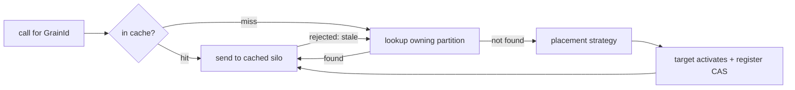

# 06 — Grain directory and placement

Two questions the runtime answers for every call:

- **Directory:** where is the activation for this `GrainId` right now?
- **Placement:** if it has no activation, which silo should create one?

These are about *grains*, not pods, so they remain application-level even on Kubernetes. The directory
is an **in-silo distributed hash table** over a consistent-hash ring — Orleans' design — built on the
membership view from [05](05-clustering-membership-k8s.md). See [ADR 0003](adr/0003-in-silo-dht-directory.md).

> Orleans references: `Orleans.Runtime/GrainDirectory/{DistributedGrainDirectory,GrainLocator,DhtGrainLocator}.cs`,
> `Orleans.Core.Abstractions/GrainDirectory/IGrainDirectory.cs`,
> `Orleans.Core.Abstractions/Placement/{PlacementStrategy,PlacementFilterStrategy}.cs`,
> `Orleans.Runtime/Placement/*`.

## Why an in-memory directory

Location entries are **ephemeral** — "grain X is activated on silo Y"; if Y dies the entry is
meaningless and the grain reactivates elsewhere. Because entries are disposable and reconstructable,
no durable external store is needed: each silo owns a partition of the directory in memory, rebalanced
on membership change. (Persistence, reminders and streams *are* durable and do use external stores,
defaulting to Redis.)

## The consistent-hash ring

The hash space is a ring; each silo owns ~100 **virtual nodes** spread around it (Orleans uses 30),
so ownership is balanced and a join/leave reshuffles only a fraction. Vnodes and grain ids are hashed
with FNV-1a + a MurmurHash3 finalizer for avalanche. `hash(GrainId)` maps a grain to a point on the
ring; the silo owning that range is its **directory owner** and holds its `GrainAddress`
(`{ grainId, silo, activationId }`). The ring is derived purely from the current `MembershipSnapshot`,
so every silo computes the same owners without coordination.

## Directory operations

```ts
interface GrainDirectory {
  lookup(grainId: GrainId): Promise<GrainAddress | undefined>;
  register(addr: GrainAddress, previous?: GrainAddress): Promise<GrainAddress>; // CAS; returns winner
  unregister(addr: GrainAddress): Promise<void>;
  unregisterSilo(silo: SiloAddress): Promise<void>;                            // bulk on failure
}
```

- **`register` is compare-and-set.** If an entry already exists (another silo won the race), the
  existing winner is returned and the loser abandons its activation and forwards — this preserves
  at-most-one activation.
- **`lookup`** returns the current address or `undefined` ("not activated — place it"). Most lookups
  are served from cache; only misses hit the owning partition.

## Location cache

Each silo keeps a read-through cache of `GrainId → GrainAddress` (Orleans' `GrainLocator` cache),
populated on lookup and successful send, and invalidated when a message to a cached address is
rejected (no such activation / wrong `podUid`) or the cached silo leaves the view. Responses can
piggyback cache-invalidation hints so a caller learns of a moved grain without a separate lookup.

## Rebalancing on membership change

Keyed off the membership view **version**, so concurrent view changes are linearised and a silo never
mixes two ring topologies.

- **On leave/crash:** entries the dead silo *owned* are lost (they were ephemeral); entries *pointing
  at* it are removed everywhere; affected grains reactivate on next call.
- **On join:** the newcomer takes over ranges from its ring neighbours via a **versioned, lossless
  handoff** — the previous owner sets aside the entries in a lost range and the newcomer **recovers**
  them by pulling from the previous owner; reads for a range still recovering **wait**, so a moved
  grain is found rather than needlessly reactivated. A lost pull falls back to drop-and-rebuild for
  those ranges (a few redundant reactivations, never a corrupt entry).

The owning partition is reached through a pluggable **directory peer**: by default `lookup` /
`register` / `unregister` / `recover` route to the owner as **system messages** over the same
transport and correlation path as grain calls (an in-process peer remains for tests). Each message
carries the sender's applied view version: a silo that is behind catches up before serving; one that
is ahead and no longer owns the grain redirects the caller (a `staleView` rejection → refresh and
re-resolve).

## Placement

When a lookup returns `undefined`, a pluggable strategy chooses the silo over the live set (Orleans'
`PlacementStrategy` + directors):

```ts
interface PlacementStrategy {
  choose(grainType: GrainType, candidates: SiloAddress[], context: PlacementContext): SiloAddress;
}
```

- **Random (default)** — `RandomPlacement`.
- **Prefer-local** — `PreferLocalPlacement`: the calling silo if a candidate, else random.
- **Activation-count (power-of-k)** — `ActivationCountBasedPlacement`: sample k, pick least loaded.
- **Stateless-worker** — `StatelessWorkerPlacement`: a local pool per silo, not directory-registered;
  calls resolve locally.
- **Silo-role** — `SiloRoleBasedPlacement`: random among silos advertising a role.
- **Resource-optimized** — `ResourceOptimizedPlacement`: least-loaded by activation count (the local
  silo's from its catalog; a peer's from membership metadata — no cross-silo load gossip yet).

A grain selects its strategy via `@grain({ placement, role, stateless })`; a per-call placement hint
can pin an activation to a silo. The directory owner itself is hash-based (Orleans' `HashBasedPlacement`).

### Placement filters

A **placement-filter** layer (Orleans `PlacementFilterStrategy`) prunes candidates *before* the
strategy chooses; filters compose. The shipped `MetadataMatchFilter` (Orleans
`PreferredMatchSiloMetadataPlacementFilter`) keeps only silos whose advertised metadata defines every
required key/value pair, declared as serializable descriptors
(`@grain({ placementFilters: [{ kind: "metadataMatch", match: { role: "worker" } }] })`); an empty
result fails with `noCandidates`. Silo metadata rides the membership snapshot (`SiloMember.metadata`),
advertised via the silo builder; deriving it from Kubernetes pod labels is a follow-up.

## Interaction summary



Together the directory and placement deliver location transparency: callers name grains by identity,
and the runtime turns that into "the right pod, right now", repairing itself as the cluster changes.
