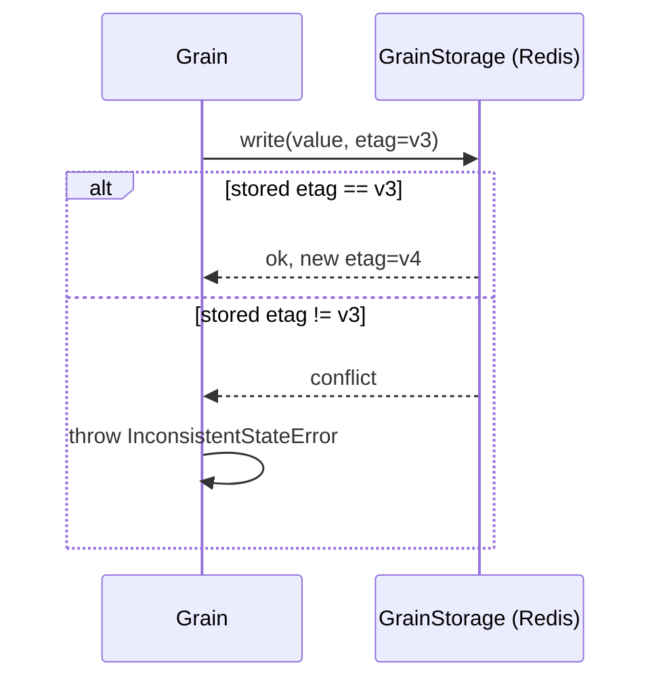

# 07 — Persistence

Grains keep state in memory while active, but that state must survive deactivation and pod loss.
Persistence is the durable home for grain state. Unlike the grain directory (which is ephemeral and
in-silo, see [06](06-grain-directory-and-placement.md)), persistence uses an **external durable
store**, defaulting to **Redis**.

> Orleans references: `Orleans.Core/Providers/IGrainStorage.cs`,
> `Orleans.Core.Abstractions/Core/IStorage.cs`,
> `Orleans.Runtime/Facet/Persistent/IPersistentState.cs`,
> `Orleans.Core/CodeGeneration/IGrainState.cs`,
> `Orleans.Persistence.Memory/Storage/MemoryStorage.cs`.

## The model

A grain declares one or more named persistent state objects. Each is read on activation (or lazily)
and written explicitly by the grain. Reads and writes go through a **storage provider**. State is
kept in memory between writes so reads are served without touching the store, exactly as in Orleans.
In the functional style, a state object is acquired with the `usePersistentState` hook on the setup
context ([02](02-actor-model.md)):

```ts
const AccountGrain = defineGrain<IAccount>("Account", (ctx) => {
  const balance = usePersistentState<BalanceState>(ctx, "balance");

  const deposit = async (amount: number): Promise<void> => {
    balance.value.cents += amount;
    await balance.write();          // durably persist
  };

  const getBalance = async (): Promise<number> =>
    balance.value.cents;            // served from memory, no store hit

  return { deposit, getBalance };
});
```

A grain may have several named states stored in different providers — e.g. `"profile"` in one store
and `"inventory"` in another — matching Orleans' multiple-named-state capability. (The class form
uses the `@persistentState("balance")` field decorator that `usePersistentState` is built on — see
the interop note in [02](02-actor-model.md).)

## Interfaces

The grain-facing facet, mirroring Orleans `IPersistentState<T>` / `IStorage<T>`:

```ts
interface PersistentState<TState> {
  value: TState;             // the in-memory state (mutable)
  readonly etag?: string;    // optimistic-concurrency token
  readonly exists: boolean;  // whether a record exists in the store

  read(): Promise<void>;     // load from store into value
  write(): Promise<void>;    // persist value; bumps etag
  clear(): Promise<void>;    // delete the record
}
```

The provider contract, mirroring Orleans `IGrainStorage`:

```ts
interface GrainStorage {
  read<T>(stateName: string, grainId: GrainId, state: StateHolder<T>): Promise<void>;
  write<T>(stateName: string, grainId: GrainId, state: StateHolder<T>): Promise<void>;
  clear<T>(stateName: string, grainId: GrainId, state: StateHolder<T>): Promise<void>;
}

interface StateHolder<T> {
  value: T;
  etag?: string;
  exists: boolean;
}
```

The provider owns serialization (via the shared `Serializer`, see
[04](04-messaging-and-serialization.md)), the storage mechanics, and etag handling. The runtime owns
when to call it.

## Optimistic concurrency with etags

Each write carries the etag the grain last read. The provider performs a conditional write: if the
stored etag differs, the write is rejected and the runtime raises an `InconsistentStateError`
(Orleans: `InconsistentStateException`). This protects against two incarnations of the same grain
(e.g. a brief split-brain, see [05](05-clustering-membership-k8s.md)) clobbering each other's state:
the stale writer fails and can re-read and retry. An **absent etag** (`undefined`, the state of a
never-written grain) means an unconditional create — matching Orleans' `IStorage.ETag` semantics,
where a null etag is the "no prior record" sentinel.



## Activation integration

- **Read on activate (default).** The runtime reads declared states before the first message, so
  `onActivate` and the first method see populated `value`. A grain can opt for lazy reads if startup
  cost matters. In the implementation `usePersistentState(ctx, name, { defaultValue })` — or the
  `@persistentState(name, { defaultValue })` field decorator it wraps — registers the facet; a
  catalog hook injects it (bound to the grain id and its provider) and reads it before
  `onActivate`. The default provider is named `"default"` (Redis in production, the in-memory
  provider for dev/tests, configured via `addStorage` / `useMemoryStorage` on the builder).
- **Write is explicit.** Nothing is persisted until the grain calls `write()`. This keeps the
  durability boundary visible in the code (Orleans takes the same stance).
- **Flush on deactivate is the grain's choice.** A grain that wants last-moment durability writes in
  `onDeactivate`; the runtime awaits it during graceful shutdown (see [03](03-runtime-and-silo.md)).

## Providers

The provider is selected per state name via configuration, with a default provider for unspecified
states. Redis is the default; see [ADR 0005](adr/0005-redis-default-providers.md) for why.

| Provider | Use | Notes |
| --- | --- | --- |
| **Redis (default)** | Production default | State stored as a serialized value per `(grainType, key, stateName)`; etag via Redis `WATCH`/`MULTI` or a Lua compare-and-set; optional TTL for cache-like grains. |
| **Postgres** | Relational alternative | One row per state, etag column, conditional `UPDATE ... WHERE etag = $1`. Good when state must be queried/reported on outside the actor model. |
| **In-memory** | Dev and tests only | A `Map` in the silo process; not durable, not shared across silos. Mirrors Orleans `MemoryGrainStorage`. |

Selecting and configuring providers is part of the hosting builder
(see [11 — Public API](11-public-api-and-examples.md)):

```ts
silo
  .addRedisStorage("default", { url: process.env.REDIS_URL })
  .addPostgresStorage("reporting", { connectionString: process.env.PG_URL });
```

A grain then names a non-default provider with
`usePersistentState(ctx, "ledger", { provider: "reporting" })` (or the equivalent
`@persistentState("ledger", { provider: "reporting" })` on a class grain).

## Reducer grains: an event-routed alternative

The `usePersistentState` facet above is the **mutable** model: read, mutate `value`, `write()`. An
alternative is the **reducer** facet `useReducerState(ctx, name, { initial, reduce })`, where command
handlers `raise` past-tense events that a pure reducer folds into *immutable* state. In **snapshot
mode** it persists the folded state through the same `GrainStorage` + etag machinery described here
(the events are transient); an append-only event log is a future mode. The two facets coexist — a
grain opts into whichever it wants.

Going one step further, `defineReducerGrain(name, { initial, reduce })` makes the *whole* grain a
single `dispatch(action)` + `query()` message loop with no per-grain method table at all, and
cross-grain work returned as Elm-style effects — the `useReducer`-shaped end state (see
[ADR 0010](adr/0010-message-dispatch-reducer-grains.md)). See [ADR 0006](adr/0006-reducer-grains.md)
for the reducer model, rationale and the snapshot-vs-event-log split, and
[`examples/bank`](../examples/bank) for both worked forms. The class field decorator
`@reducerState(name, { initial, reduce })` that `useReducerState` wraps remains available for interop.

## What persistence does not do

- It does not give cross-grain ACID transactions. The etag write here is atomic for a **single
  grain**; spanning a change across grains is a separate facet — the versioned `TransactionalState`
  of [ADR 0008](adr/0008-cross-grain-transactions.md), shipped in Phase 7 (mirroring Orleans'
  `Orleans.Transactions`). The two facets coexist on a grain.
- It does not automatically write on every field mutation; durability is explicit via `write()`.
- It does not replace the directory; a grain's *location* is ephemeral and never persisted here.
