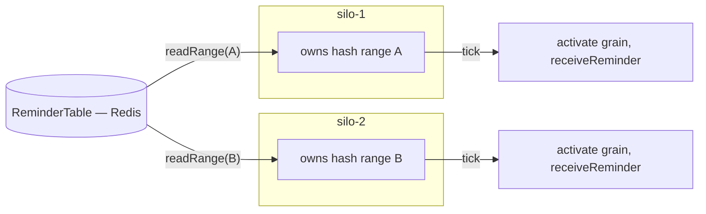

# 08 — Timers and reminders

Grains often need to do something later or periodically. There are two mechanisms with very
different durability guarantees, mirroring Orleans exactly.

> Orleans references: `Orleans.Core.Abstractions/Runtime/IGrainTimer.cs`,
> `Orleans.Runtime/Timers/GrainTimer.cs`,
> `Orleans.Reminders/Timers/IRemindable.cs`,
> `Orleans.Reminders/SystemTargetInterfaces/IReminderService.cs`,
> `Orleans.Reminders/SystemTargetInterfaces/IReminderTable.cs`,
> `Orleans.Reminders/ReminderService/LocalReminderService.cs`.

## Timers vs reminders at a glance

| | Timer | Reminder |
| --- | --- | --- |
| Durable | No | Yes |
| Survives deactivation | No (cancelled on deactivate) | Yes (reactivates the grain) |
| Survives pod/silo loss | No | Yes (fires from another silo) |
| Backed by | In-memory on the activation | A durable store (Redis default) |
| Granularity | Sub-second possible | Coarser (minutes-scale typical) |
| Use for | Short-lived, best-effort, in-activation work | Guaranteed, long-lived schedules |

Rule of thumb: a timer is an optimisation tied to the current activation; a reminder is a durable
promise to call the grain even if everything restarts.

## Timers

A timer fires a callback on the grain's activation, as a turn (so it respects single-threaded
execution — see [02](02-actor-model.md)). It is non-durable and is cancelled automatically when the
activation is deactivated.

```ts
@grain()
class SessionGrain extends Grain implements ISession {
  private heartbeat?: GrainTimer;

  async onActivate(): Promise<void> {
    this.heartbeat = this.runtime.registerTimer(
      () => this.checkIdle(),
      { seconds: 30 },   // due
      { seconds: 30 },   // period (omit for one-shot)
    );
  }

  private async checkIdle(): Promise<void> { /* runs as a normal turn */ }

  async onDeactivate(): Promise<void> {
    this.heartbeat?.dispose();
  }
}
```

```ts
interface GrainTimer {
  change(due: Duration, period?: Duration): void;
  dispose(): void;
}
```

Timer ticks are delivered as turns on the activation, so the callback never races other grain
methods. A timer does **not** keep a grain alive by itself; if the grain would otherwise be
collected, the timer goes with it (matching Orleans' default timer behaviour).

## Reminders

A reminder is a **durable, named schedule** attached to a grain identity. It is persisted, so it
fires even if the grain was deactivated or the hosting silo died — the runtime activates the grain
(on whichever silo it is then placed) and delivers the tick. Grains receive reminders by
implementing `Remindable`.

```ts
@grain()
class BillingGrain extends Grain implements IBilling, Remindable {
  async startMonthlyInvoice(): Promise<void> {
    await this.runtime.registerReminder("invoice", { days: 1 }, { days: 30 });
  }

  async receiveReminder(name: string, tick: TickStatus): Promise<void> {
    if (name === "invoice") await this.issueInvoice();
  }

  async stop(): Promise<void> {
    await this.runtime.unregisterReminder("invoice");
  }
}
```

```ts
interface Remindable {
  receiveReminder(name: string, status: TickStatus): Promise<void>;
}

interface TickStatus {
  firstTickAt: Date;     // when the reminder was created
  period: Duration;
  currentTickAt: Date;   // scheduled time of this tick
}
```

### Reminder service and table

Reminders are stored in a pluggable `ReminderTable` and driven by a per-silo reminder service,
mirroring Orleans' `IReminderTable` + `LocalReminderService`.

```ts
interface ReminderTable {
  upsert(entry: ReminderEntry): Promise<string>;                 // returns new etag
  remove(grainId: GrainId, name: string, etag: string): Promise<boolean>;
  read(grainId: GrainId, name: string): Promise<ReminderEntry | undefined>;
  readForGrain(grainId: GrainId): Promise<ReminderEntry[]>;
  readRange(hashBegin: number, hashEnd: number): Promise<ReminderEntry[]>;  // for ownership
}

interface ReminderEntry {
  grainId: GrainId;
  name: string;
  startAt: Date;
  period: Duration;
  etag: string;
}
```

### Distribution across silos

Reminder *responsibility* is partitioned across silos by the **same consistent-hash ring** the
directory uses (see [06](06-grain-directory-and-placement.md)): each silo owns a hash range and is
responsible for firing the reminders whose `grainId` hashes into its range. On startup and on every
membership change, each silo reads its range from the table (`readRange`) and schedules those
reminders locally.



When a silo leaves, its ranges are reassigned to the new owners on the next membership view, and
those owners pick up the affected reminders from the table — so no reminder is dropped across a
failure, only briefly delayed. This is the durability guarantee timers cannot offer.

### Providers

| Provider | Use |
| --- | --- |
| **Redis (default)** | Reminder entries keyed for range scans by grain-hash; etag via compare-and-set. |
| **Postgres** | Relational alternative; range query on a hash column. |
| **In-memory** | Dev/tests only; not durable, single-silo. |

Redis is the default; see [ADR 0005](adr/0005-redis-default-providers.md). Configured on the hosting
builder, e.g. `silo.useRedisReminders({ url: process.env.REDIS_URL })`.

The implementation ships in-memory timers (`registerTimer`, fired as turns via the injectable clock,
cancelled on deactivation) and the in-memory `ReminderTable` + `LocalReminderService` (hash-range
ownership, periodic firing, durable cursors via the table, silo-handoff via `refreshOwnership`). A
grain's `registerReminder` delegates to the service, and a tick reactivates the grain and delivers
`receiveReminder` as a turn. A single silo currently owns the whole ring; multi-silo ring-derived
ownership and the Redis/Postgres tables are future work.

## Choosing between them

- Need it to survive restarts or fire after the grain has been idle for a long time? **Reminder.**
- Just want periodic work while the grain happens to be active, with fine granularity? **Timer.**
- Common pattern: a coarse **reminder** wakes the grain; the grain then uses a fine-grained **timer**
  while it is active.
