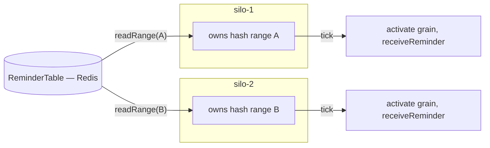

# 08 — Timers and reminders

Grains often need to do something later or periodically. There are two mechanisms with very
different durability guarantees, mirroring Orleans exactly.

> Orleans references: `Orleans.Core.Abstractions/Runtime/IGrainTimer.cs`,
> `Orleans.Runtime/Timers/GrainTimer.cs`,
> `Orleans.Reminders/Timers/IRemindable.cs`,
> `Orleans.Reminders/SystemTargetInterfaces/IReminderService.cs`,
> `Orleans.Reminders/SystemTargetInterfaces/IReminderTable.cs`,
> `Orleans.Reminders/ReminderService/LocalReminderService.cs`.

## Timers vs reminders at a glance

| | Timer | Reminder |
| --- | --- | --- |
| Durable | No | Yes |
| Survives deactivation | No (cancelled on deactivate) | Yes (reactivates the grain) |
| Survives pod/silo loss | No | Yes (fires from another silo) |
| Backed by | In-memory on the activation | A durable store (Redis default) |
| Granularity | Sub-second possible | Coarser (minutes-scale typical) |
| Use for | Short-lived, best-effort, in-activation work | Guaranteed, long-lived schedules |

Rule of thumb: a timer is an optimisation tied to the current activation; a reminder is a durable
promise to call the grain even if everything restarts.

## Timers

A timer fires a callback on the grain's activation, as a turn (so it respects single-threaded
execution — see [02](02-actor-model.md)). It is non-durable and is cancelled automatically when the
activation is deactivated.

```ts
const SessionGrain = defineGrain<ISession>("Session", (ctx) => {
  let heartbeat: GrainTimer | undefined;

  const checkIdle = async (): Promise<void> => { /* runs as a normal turn */ };

  return {
    onActivate: async () => {
      heartbeat = ctx.runtime.registerTimer(
        checkIdle,
        { seconds: 30 },   // due
        { seconds: 30 },   // period (omit for one-shot)
      );
    },
    onDeactivate: async () => heartbeat?.dispose(),
    // ... grain methods ...
  };
});
```

```ts
interface GrainTimer {
  change(due: Duration, period?: Duration): void;
  dispose(): void;
}
```

Timer ticks are delivered as turns on the activation, so the callback never races other grain
methods. A timer does **not** keep a grain alive by itself; if the grain would otherwise be
collected, the timer goes with it (matching Orleans' default timer behaviour).

## Reminders

A reminder is a **durable, named schedule** attached to a grain identity. It is persisted, so it
fires even if the grain was deactivated or the hosting silo died — the runtime activates the grain
(on whichever silo it is then placed) and delivers the tick.

A grain receives reminders by returning a `receiveReminder` method (the `Remindable` shape):

```ts
const BillingGrain = defineGrain<IBilling>("Billing", (ctx) => {
  const issueInvoice = async (): Promise<void> => { /* ... */ };

  return {
    startMonthlyInvoice: async () =>
      ctx.runtime.registerReminder("invoice", { days: 1 }, { days: 30 }),

    stop: async () => ctx.runtime.unregisterReminder("invoice"),

    // Remindable: the runtime reactivates the grain and delivers the tick as a turn.
    receiveReminder: async (name: string, _tick: TickStatus) => {
      if (name === "invoice") await issueInvoice();
    },
  };
});
```

```ts
interface Remindable {
  receiveReminder(name: string, status: TickStatus): Promise<void>;
}

interface TickStatus {
  firstTickAt: Date;     // when the reminder was created
  period: Duration;
  currentTickAt: Date;   // scheduled time of this tick
}
```

**Tick semantics, faithful to Orleans.** A reminder fires at `firstTickAt + N·period`. Ticks are
**not caught up**: if the owning silo was down or the grain unreachable when a tick was due, that
tick is skipped rather than replayed in a burst — firing resumes at the next scheduled time, and
`currentTickAt` always reports the *scheduled* time (which the handler can compare against now to
detect lateness). Each tick is delivered as an ordinary single-threaded **turn** on the grain's
activation (it is `IRemindable.ReceiveReminder`, not a free-running callback), so it never races the
grain's other methods. Unregistering a reminder mid-flight cleanly stops future ticks.

### Reminder service and table

Reminders are stored in a pluggable `ReminderTable` and driven by a per-silo reminder service,
mirroring Orleans' `IReminderTable` + `LocalReminderService`.

```ts
interface ReminderTable {
  upsert(entry: ReminderEntry): Promise<string>;                 // returns new etag
  remove(grainId: GrainId, name: string, etag: string): Promise<boolean>;
  read(grainId: GrainId, name: string): Promise<ReminderEntry | undefined>;
  readForGrain(grainId: GrainId): Promise<ReminderEntry[]>;
  readRange(hashBegin: number, hashEnd: number): Promise<ReminderEntry[]>;  // for ownership
}

interface ReminderEntry {
  grainId: GrainId;
  name: string;
  startAt: Date;
  period: Duration;
  etag: string;
}
```

### Distribution across silos

Reminder *responsibility* is partitioned across silos by the **same consistent-hash ring** the
directory uses (see [06](06-grain-directory-and-placement.md)): each silo owns the hash ranges the
ring assigns it (`ConsistentHashRing.rangesFor`) and is responsible for firing the reminders whose
`grainId` hashes into them. On startup and on every membership change, each silo reads its ranges
from the table (`readRange`) and schedules those reminders locally. It also re-reads them
periodically, so a reminder registered on a silo that does not own it (registration just writes the
durable table) is discovered and fired by the silo that does.

A fired tick is **routed to the grain's single activation through the dispatcher** (directory →
placement), exactly like a method call — so the silo that owns the *reminder* never spins up a second
activation when the grain lives elsewhere; an idle grain is reactivated wherever it is placed.



When a silo leaves, its ranges are reassigned to the new owners on the next membership view, and
those owners pick up the affected reminders from the table — so no reminder is dropped across a
failure, only briefly delayed. This is the durability guarantee timers cannot offer.

### Providers

| Provider | Use |
| --- | --- |
| **Redis (default)** | Reminder entries keyed for range scans by grain-hash; etag via compare-and-set. |
| **Postgres** | Relational alternative; range query on a hash column. |
| **In-memory** | Dev/tests only; not durable, single-silo. |

Redis is the default; see [ADR 0005](adr/0005-redis-default-providers.md). Configured on the hosting
builder, e.g. `silo.useRedisReminders({ url: process.env.REDIS_URL })`.

The implementation ships in-memory timers (`registerTimer`, fired as turns via the injectable clock,
cancelled on deactivation) and the in-memory `ReminderTable` + `LocalReminderService` (hash-range
ownership, periodic firing, durable cursors via the table, silo-handoff via `refreshOwnership`). A
grain's `registerReminder` delegates to the service, and a tick reactivates the grain and delivers
`receiveReminder` as a turn on its single activation. Ownership is ring-derived and rebalances on
membership change across silos. A durable `RedisReminderTable` also ships (`useRedisReminders`):
reminders are Redis hashes indexed in a sorted set by grain-hash so `readRange` is a server-side
range query, with atomic Lua upsert/remove and etag CAS — interchangeable with the in-memory table.
A durable `PostgresReminderTable` also ships (`usePostgresReminders`): each reminder is a row with an
indexed `hash` column so `readRange` (including wrap-around) is a server-side range query, with an
etag-CAS remove — likewise interchangeable.

## Choosing between them

- Need it to survive restarts or fire after the grain has been idle for a long time? **Reminder.**
- Just want periodic work while the grain happens to be active, with fine granularity? **Timer.**
- Common pattern: a coarse **reminder** wakes the grain; the grain then uses a fine-grained **timer**
  while it is active.
