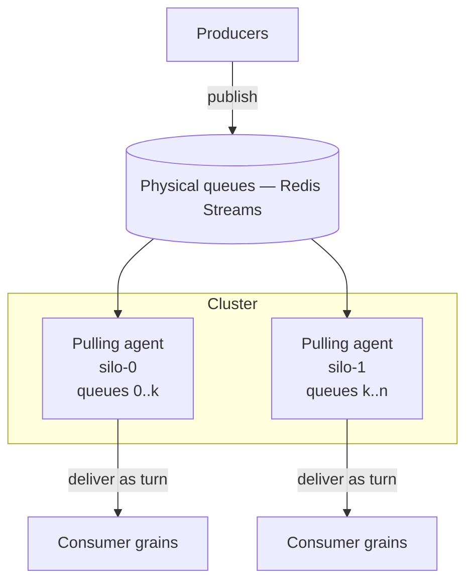

# 09 — Event streams

Streams let grains and clients publish and consume sequences of events in near real-time, decoupled
from one another. Like Orleans, streams are **managed**: you do not create or register a stream
before using it — you address one by identity and publish or subscribe. Streams are durable and
**default to Redis Streams** as the backing store.

> Orleans references: `Orleans.Streaming/Providers/IStreamProvider.cs`,
> `Orleans.Streaming/Core/IAsyncStream.cs`,
> `Orleans.Streaming/Core/StreamSubscriptionHandle.cs`,
> `Orleans.Streaming/PersistentStreams/PersistentStreamProvider.cs`,
> `Orleans.Streaming/PersistentStreams/PersistentStreamPullingAgent.cs`,
> `Orleans.Streaming/PersistentStreams/IStreamQueueBalancer.cs`,
> `Orleans.Streaming/PersistentStreams/IStreamQueueCheckpointer.cs`.

## Concepts

- **Stream identity** — `(provider, namespace, key)`. The namespace groups related streams (e.g.
  `"device-telemetry"`); the key identifies one stream within it (e.g. a device id). Stable and
  meaningful, like a `GrainId`.
- **Producer** — anything holding a stream handle calls `publish(event)`.
- **Consumer** — a grain or client `subscribe`s with a handler; it receives events in order.
- **Subscription** — a durable record that a consumer is interested in a stream. Survives
  deactivation: when the consuming grain reactivates, its subscriptions are re-established.
- **Cursor / checkpoint** — the position a consumer has processed up to. Lets a consumer resume
  exactly where it left off after deactivation or failure.

## API

```ts
interface StreamProvider {
  getStream<T>(namespace: string, key: GrainKey): AsyncStream<T>;
}

interface AsyncStream<T> {
  readonly id: StreamId;
  publish(event: T): Promise<void>;
  subscribe(handler: StreamHandler<T>, options?: SubscribeOptions): Promise<StreamSubscriptionHandle<T>>;
  // re-bind this consumer's existing subscriptions after reactivation:
  getSubscriptions(consumerId?: string): Promise<StreamSubscriptionHandle<T>[]>;
}

interface StreamHandler<T> {
  onNext(event: T, token: SequenceToken): Promise<void>;
  onError?(err: unknown): Promise<void>;
  onCompleted?(): Promise<void>;
}

interface StreamSubscriptionHandle<T> {
  resume(handler: StreamHandler<T>): Promise<void>;  // after reactivation
  unsubscribe(): Promise<void>;
}

interface SubscribeOptions {
  startToken?: SequenceToken;   // rewind to a position the backing store still has
  consumerId?: string;          // scopes the subscription to a consumer; the runtime binds it
}
```

This mirrors Orleans' `IStreamProvider` / `IAsyncStream<T>` / `StreamSubscriptionHandle<T>` and the
`IAsyncObserver` callback shape.

### Producer example

```ts
@grain()
class DeviceGrain extends Grain implements IDevice {
  async report(reading: Reading): Promise<void> {
    const stream = this.runtime.getStreamProvider().getStream<Reading>("telemetry", this.id.key);
    await stream.publish(reading);
  }
}
```

### Consumer example (grain)

```ts
@grain()
class AggregatorGrain extends Grain implements IAggregator {
  async onActivate(): Promise<void> {
    const stream = this.runtime.getStreamProvider().getStream<Reading>("telemetry", this.id.key);
    // re-attach durable subscriptions, or create one the first time:
    const subs = await stream.getSubscriptions();
    if (subs.length > 0) await subs[0].resume(this.handler());
    else await stream.subscribe(this.handler());
  }

  private handler(): StreamHandler<Reading> {
    return { onNext: async (reading, token) => { /* aggregate; checkpoint via token */ } };
  }
}
```

Delivery into a consuming grain happens **as a turn** on that grain's activation, so stream handlers
respect single-threaded execution just like method calls (see [02](02-actor-model.md)).

### Fan-out and per-consumer subscriptions

Many grains can subscribe to the *same* stream — a room stream with many members, a topic with many
followers. Each subscriber gets every event, delivered as a turn on its own activation. Because a
subscription is durable and outlives the consumer's activation, `getSubscriptions()` is **scoped to
the calling grain**: the runtime binds the consumer's identity, so a consumer that deactivated while
idle reacquires *its own* subscription (and cursor) on reactivation rather than a neighbour's. The
`subs[0]` re-bind pattern above is therefore correct even when thousands of consumers share one
stream. The runnable [`examples/chat`](11-public-api-and-examples.md) exercises exactly this:
a member that goes idle and is collected later resumes from where it left off, recovering only the
messages it missed.

Delivery is decoupled from `subscribe`/`resume` — those return without awaiting delivery, because a
grain may subscribe or resume from within a turn and each `onNext` is itself a turn on the same
activation; awaiting would deadlock the consumer against its own queue.

## Architecture: pulling agents over physical queues

The design follows Orleans' persistent-stream architecture: many logical streams are multiplexed
over a smaller number of **physical queues**, and the work of pulling those queues is distributed
across the cluster.



- **Physical queues.** A fixed set of Redis Streams (e.g. 8/16/32) acts as the transport. A logical
  stream id is hashed to one physical queue, so all events for a given stream stay ordered within
  that queue. This is Orleans' "many streams over few queues" multiplexing.
- **Pulling agents.** Each silo runs pulling agents for the physical queues it owns. An agent reads
  batches from its queue and delivers each event to the subscribed consumer grains.
- **Queue ownership / balancing.** Physical queues are distributed across silos using the same
  consistent-hash ring as the directory and reminders (Orleans abstracts this as an
  `IStreamQueueBalancer`). On membership change, queue ownership rebalances; a newly responsible silo
  resumes the queue from the last committed cursor.
- **Cursors / checkpoints.** Each subscription's processed position is checkpointed durably (Orleans:
  `IStreamQueueCheckpointer`). On reactivation or rebalance, delivery resumes from the cursor, giving
  **at-least-once** delivery.

## Delivery semantics

- **At-least-once.** Events are redelivered after a crash up to the last committed cursor; consumers
  should be idempotent. (Redis Streams consumer groups give us per-queue acknowledgement to support
  this.)
- **Per-stream ordering.** Events within a single logical stream are delivered in publish order,
  because that stream maps to a single physical queue.
- **Rewind.** A consumer can subscribe from an earlier `SequenceToken` if the backing store still
  retains those entries (Redis Stream trimming policy governs retention).
- **Implicit subscriptions (later phase).** Orleans supports binding a grain type to a stream
  namespace so the grain is auto-subscribed by key. This is noted in the
  [roadmap](13-roadmap-and-phases.md) as a follow-on to explicit subscriptions.

## Providers

| Provider | Use |
| --- | --- |
| **Redis Streams (default)** | Physical queues are Redis Streams; consumer groups give acknowledgement and redelivery; cursors stored per subscription. |
| **In-memory** | Dev/tests only; single-silo, non-durable; useful for unit-testing producer/consumer grains. |

Redis Streams is the default; see [ADR 0005](adr/0005-redis-default-providers.md). The provider
interface keeps other backings (e.g. a log/queue service) open as future work, exactly as Orleans
supports multiple queue adapters behind `PersistentStreamProvider`.

Configured on the hosting builder, e.g.
`silo.addRedisStreams("default", { url: process.env.REDIS_URL, partitions: 16 })`.

The implementation ships the in-memory `MemoryStreamProvider`: events addressed by
`(provider, namespace, key)`, ordered delivery to each subscriber, a per-subscription cursor that
only advances after `onNext` resolves (so a thrown handler is redelivered — at-least-once), resume
from the cursor after a consumer drops, and rewind via a `startToken`. The grain-facing
`getStreamProvider` (configured with `useMemoryStreams` on the builder) delivers each `onNext` as a
turn on the consumer's activation and re-binds durable subscriptions on reactivation via
`getSubscriptions`/`resume`. A durable `RedisStreamProvider` also ships (`addRedisStreams`): events
are appended with XADD under monotonic ids, each consumer's cursor is stored in Redis (so it resumes
on any silo after a restart), and delivery is a non-blocking XRANGE poll that advances the cursor
only after `onNext` resolves — interchangeable with the in-memory provider. The pulling-agent /
queue-ownership machinery (partitioning streams across silos over the ring) is future work behind the
same `StreamProvider` interface.
