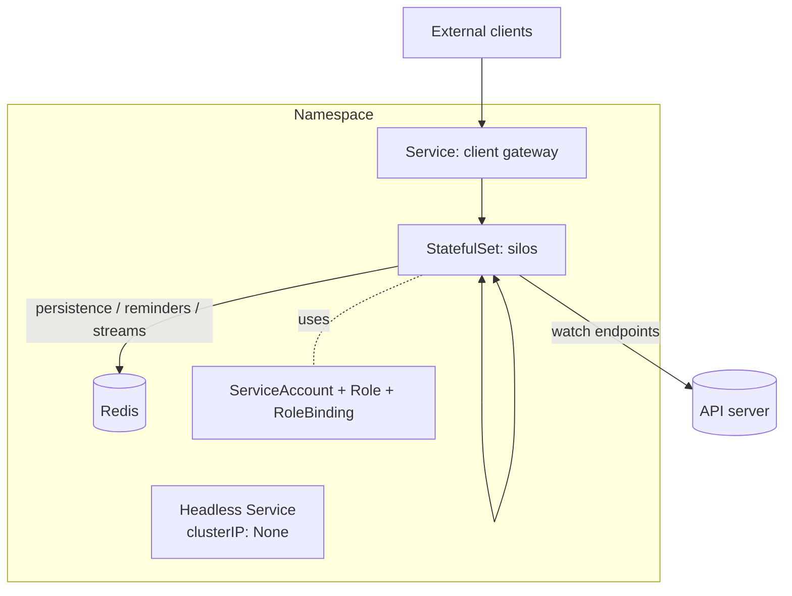

# 10 — Kubernetes hosting

How a silo cluster is deployed and operated on Kubernetes (see
[05 — Clustering](05-clustering-membership-k8s.md)). Working, deployable manifests ship in
[`examples/k8s-silo/deploy/`](../examples/k8s-silo/deploy); this doc covers the shape and rationale.

> Orleans references: `Orleans.Hosting.Kubernetes/{KubernetesClusterAgent,KubernetesHostingOptions,KubernetesHostingExtensions}.cs`,
> `Orleans.Runtime/Lifecycle/ISiloLifecycle.cs` (the staged start/stop the graceful drain mirrors).

## Topology



- **StatefulSet** — stable ordinal pod names (`silo-0`, …) that persist across restarts, so a
  restarted silo rejoins the directory ring in the same logical position ([06](06-grain-directory-and-placement.md)).
  A `Deployment`'s random names would reshuffle the ring unnecessarily.
- **Headless Service** (`clusterIP: None`) — its EndpointSlices are the membership source of truth and
  provide per-pod DNS for silo-to-silo connections.
- **Gateway Service** — a normal load-balanced Service for external clients.
- **Redis** — the default durable backend (managed or in-cluster).
- **ServiceAccount + RBAC** — minimal, namespace-scoped, read-only *watch* on pods/endpoints/endpointslices.

## Probes and failure detection

The silo serves HTTP health endpoints that drive membership:

- **Readiness** (`/ready`) — healthy only when fully joined (transport accepting, membership watch
  established, not draining). Controls Service endpoint membership — i.e. whether the silo is a live
  member and placement candidate.
- **Liveness** (`/live`) — process/event-loop responsive; a failure restarts the container (new
  `podUid` = new incarnation).
- **Startup** (`/startup`) — guards slow cold starts so liveness doesn't kill a still-initialising silo.

On `SIGTERM` the silo flips `/ready` to not-ready first, so Kubernetes removes it from endpoints (and
every peer's view) before it deactivates grains; the drain then tears services down in reverse start
order (the `ISiloLifecycle` ordered-stop guarantee), keeping transport serving in-flight turns until
state is flushed ([03](03-runtime-and-silo.md)).

## Manifests

The deployable set — ServiceAccount + Role + RoleBinding (watch endpoints), the headless Service
(`publishNotReadyAddresses: false`), the StatefulSet, and a PodDisruptionBudget — is in
[`examples/k8s-silo/deploy/`](../examples/k8s-silo/deploy). The key wiring on the StatefulSet pod:

- inject `POD_NAME` / `POD_UID` / `POD_NAMESPACE` via the downward API (these populate the
  `SiloAddress`, [05](05-clustering-membership-k8s.md)), plus `CLUSTER_ID` and `REDIS_URL`;
- expose the silo port (11111) and health port (8080) with the three probes above;
- `serviceAccountName: silo` and a `terminationGracePeriodSeconds` long enough to drain and flush.

## Scaling and rolling updates

- **Scale out/in** — adding/removing pods joins/leaves the membership view; directory, reminder, and
  stream-queue ownership rebalance off the ring, and grains rebalance as they reactivate.
- **Rolling update** — the StatefulSet replaces pods one at a time (`OrderedReady`), each draining
  first. With a uniform image this is just drain-and-rejoin. For a **heterogeneous** update where new
  pods declare a higher interface version, **grain-interface versioning**
  ([ADR 0014](adr/0014-grain-interface-versioning.md)) makes placement version-aware so v1 and v2 pods
  coexist during the roll.

## Local development

- **kind / minikube** — a single-node cluster runs the StatefulSet with an in-cluster Redis for an
  end-to-end environment.
- **Out-of-cluster** — silos run as local processes with in-memory providers and static membership
  (configured on the builder; [11](11-public-api-and-examples.md)). This is how tests run without a
  cluster ([12](12-project-structure-and-tooling.md)).

## Running the example

[`examples/k8s-silo`](../examples/k8s-silo) is a runnable silo wired for Kubernetes (membership from
EndpointSlices via `useKubernetesMembership`, WebSocket transport over per-pod IPs, durable Redis
state, the health probes, and a small HTTP API over a counter grain). The image needs no build step
(it runs under `vite-node`):

```sh
docker build -t tsva-k8s-silo:dev -f examples/k8s-silo/Dockerfile .   # kind: then `kind load docker-image tsva-k8s-silo:dev`
kubectl create namespace tsva
kubectl -n tsva apply -f examples/k8s-silo/deploy/
kubectl -n tsva rollout status statefulset/silo
```

Its opt-in e2e (gated on a reachable cluster) asserts the cluster forms, calls route to one activation
across pods, a killed pod's grain reactivates on a survivor with state intact, and a rolling update
preserves state:

```sh
K8S_E2E=1 pnpm exec vitest run examples/k8s-silo/src/k8s-e2e.test.ts
```
