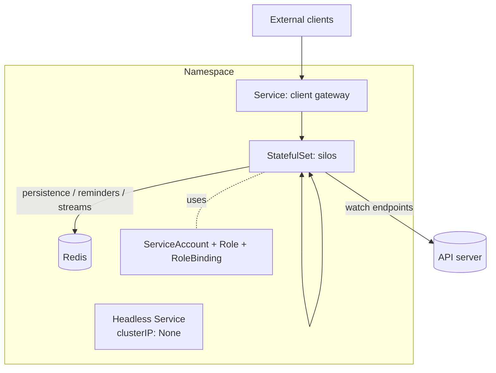

# 10 — Kubernetes hosting

This document describes how a silo cluster is deployed and operated on Kubernetes, and the manifests
that wire up membership, failure detection and discovery (see
[05 — Clustering](05-clustering-membership-k8s.md)).

## Topology



- **StatefulSet** of silos — stable pod names (`silo-0`, `silo-1`, …) and stable identity across
  restarts, which the directory ring relies on (see [06](06-grain-directory-and-placement.md)).
- **Headless Service** — `clusterIP: None`, selecting the silos. Its EndpointSlices are the
  membership source of truth and provide per-pod DNS for silo-to-silo connections.
- **Gateway Service** — a normal (load-balanced) Service for external clients to reach any silo.
- **Redis** — the default durable backend for persistence, reminders and streams. Managed
  (e.g. a cloud Redis) or in-cluster.
- **ServiceAccount + RBAC** — grants each silo permission to *watch* pods/endpoints in its namespace.

## Why a StatefulSet (not a Deployment)

The directory ring keys ranges off stable silo identity. A `StatefulSet` gives stable ordinal pod
names that persist across restarts, so a restarted `silo-2` rejoins the ring in the same logical
position. A `Deployment` assigns random pod names on every restart, which would reshuffle the ring
more than necessary. Stateless-worker grains (see [06](06-grain-directory-and-placement.md)) can
still run on any pod; it is the directory's stability that motivates the StatefulSet.

## Probes and the failure detector

The silo exposes an HTTP health endpoint. Kubernetes probes drive membership:

- **Readiness** (`/ready`) — returns healthy only when the silo is fully joined: transport
  accepting connections, membership watch established, and not draining. Controls whether the pod is
  in the Service's endpoints — i.e. whether it is a live cluster member and a placement candidate.
- **Liveness** (`/live`) — returns healthy when the process and event loop are responsive. A failed
  liveness probe restarts the container (producing a new `podUid`, recognised as a new incarnation).
- **Startup** (`/startup`) — guards slow cold starts so liveness does not kill a still-initialising
  silo.

When a silo starts draining on `SIGTERM`, `/ready` flips to not-ready first, so Kubernetes removes it
from endpoints (and thus from every peer's membership view) before it finishes deactivating grains.
See the shutdown sequence in [03](03-runtime-and-silo.md).

## Reference manifests

> Illustrative, not final. `<cluster>` is the application/cluster name; image and resources are
> placeholders.

### ServiceAccount and RBAC (watch endpoints)

```yaml
apiVersion: v1
kind: ServiceAccount
metadata:
  name: silo
---
apiVersion: rbac.authorization.k8s.io/v1
kind: Role
metadata:
  name: silo-membership
rules:
  - apiGroups: [""]
    resources: ["pods", "endpoints"]
    verbs: ["get", "list", "watch"]
  - apiGroups: ["discovery.k8s.io"]
    resources: ["endpointslices"]
    verbs: ["get", "list", "watch"]
---
apiVersion: rbac.authorization.k8s.io/v1
kind: RoleBinding
metadata:
  name: silo-membership
subjects:
  - kind: ServiceAccount
    name: silo
roleRef:
  kind: Role
  name: silo-membership
  apiGroup: rbac.authorization.k8s.io
```

The RBAC is deliberately minimal: read-only watch on membership-relevant resources, namespace-scoped.

### Headless Service (membership + silo-to-silo)

```yaml
apiVersion: v1
kind: Service
metadata:
  name: silo-headless
  labels: { app: <cluster> }
spec:
  clusterIP: None
  publishNotReadyAddresses: false   # only ready pods are members
  selector: { app: <cluster> }
  ports:
    - name: silo
      port: 11111
```

### StatefulSet

```yaml
apiVersion: apps/v1
kind: StatefulSet
metadata:
  name: silo
spec:
  serviceName: silo-headless
  replicas: 3
  selector:
    matchLabels: { app: <cluster> }
  template:
    metadata:
      labels: { app: <cluster> }
    spec:
      serviceAccountName: silo
      terminationGracePeriodSeconds: 60   # time to drain in-flight turns + flush state
      containers:
        - name: silo
          image: <registry>/<cluster>-silo:latest
          ports:
            - { name: silo, containerPort: 11111 }
            - { name: health, containerPort: 8080 }
          env:
            - name: POD_NAME
              valueFrom: { fieldRef: { fieldPath: metadata.name } }
            - name: POD_UID
              valueFrom: { fieldRef: { fieldPath: metadata.uid } }
            - name: POD_NAMESPACE
              valueFrom: { fieldRef: { fieldPath: metadata.namespace } }
            - name: CLUSTER_ID
              value: <cluster>
            - name: REDIS_URL
              valueFrom: { secretKeyRef: { name: redis, key: url } }
          readinessProbe:
            httpGet: { path: /ready, port: health }
            periodSeconds: 5
          livenessProbe:
            httpGet: { path: /live, port: health }
            periodSeconds: 10
          startupProbe:
            httpGet: { path: /startup, port: health }
            failureThreshold: 30
            periodSeconds: 2
```

The pod injects `POD_NAME` / `POD_UID` / `POD_NAMESPACE` via the downward API; these populate the
`SiloAddress` (see [05](05-clustering-membership-k8s.md)).

### PodDisruptionBudget

```yaml
apiVersion: policy/v1
kind: PodDisruptionBudget
metadata:
  name: silo
spec:
  minAvailable: 2
  selector:
    matchLabels: { app: <cluster> }
```

Keeps enough silos up during voluntary disruptions (node drains, rollouts) that the directory and
reminder/stream ownership can rebalance without losing availability.

## Scaling and rolling updates

- **Scale out.** Increasing `replicas` adds pods; each joins the membership view and takes over ring
  ranges from neighbours (directory, reminders, stream queues rebalance — see
  [06](06-grain-directory-and-placement.md), [08](08-timers-and-reminders.md),
  [09](09-event-streams.md)). Grains gradually rebalance as they reactivate.
- **Scale in.** Removing pods triggers graceful drain per pod; their grains reactivate elsewhere and
  their owned ranges reassign.
- **Rolling update.** The StatefulSet replaces pods one at a time (`OrderedReady`). Each replaced
  pod drains gracefully first. Because v1 assumes a uniform image (no incompatible grain-interface
  versions — see [01 non-goals](01-overview-and-goals.md)), a rolling update is just a sequence of
  drain-and-rejoin events the cluster already handles.

## Local development

- **kind / minikube.** A single-node cluster runs the StatefulSet with `replicas: 1..3` and an
  in-cluster Redis for an end-to-end environment.
- **Out-of-cluster mode.** For fast iteration, silos can run as local processes using the in-memory
  providers and a static membership list instead of the Kubernetes watch (selected by configuration
  on the hosting builder — see [11](11-public-api-and-examples.md)). This is how unit and
  integration tests run without a cluster (see [12](12-project-structure-and-tooling.md)).
