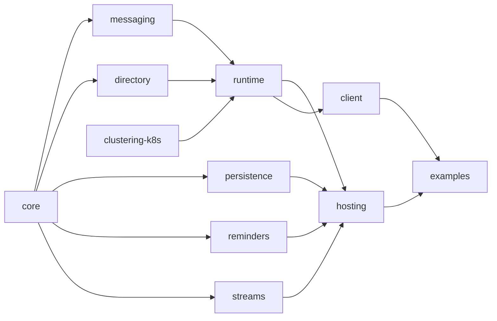

# 12 — Project structure and tooling

How the codebase is organised, built, and tested.

## Monorepo layout

A [pnpm workspace](https://pnpm.io/workspaces) of focused packages with explicit dependencies.
Packages depend inward (abstractions at the centre, hosting at the edge).

```
ts-virtual-actors/
  package.json                 # workspace root
  pnpm-workspace.yaml
  tsconfig.base.json
  docs/
  packages/
    core/                      # abstractions: GrainId, interfaces, decorators, envelope types
    messaging/                 # Transport interface, WebSocket transport, Serializer
    runtime/                   # silo, catalog, turn scheduler, dispatcher, placement
    directory/                 # DHT grain directory + location cache + ring
    clustering-k8s/            # Kubernetes membership service
    persistence/               # GrainStorage interface + redis/postgres/memory providers
    reminders/                 # reminder service + table providers
    streams/                   # StreamProvider interface + redis-streams/memory providers
    client/                    # external client (createClient → getGrain via a gateway silo)
    hosting/                   # silo builder, health endpoints, graceful drain
  examples/
    greeter/                   # smallest grain: activation, turns, idle reset
    chat/                      # stream fan-out + durable resume
    cluster/                   # 3 silos over WebSocket: routing + failover
    bank/                      # reducer grains (ADR 0006)
    thermostat/                # the worked example from docs/11
```

Implemented today: `core`, `messaging`, `directory`, `runtime`, `clustering-k8s`, `persistence`,
`reminders`, `streams`, `hosting`, `client`, and the `examples/*` above. The `persistence` /
`reminders` / `streams` packages currently ship their **in-memory** providers — Redis/Postgres
backings are future work behind the same interfaces.

### Dependency direction



`core` has no internal dependencies. `hosting` composes everything into a runnable silo. `client`
depends only on what an external caller needs (proxies, transport, serialization).

In the implementation, `runtime` depends on `core`, `messaging` and `directory`; the
`clustering-k8s`, `persistence`, `reminders` and `streams` packages depend only on `core` and are
composed by `hosting`. The clock (`TimeProvider`) lives in `core` since several packages read it.

## Module conventions

Per the project house style:

- **No `index.ts` barrel files.** Import from explicit module paths
  (`@tsva/core/grain-id`, not `@tsva/core`). This keeps import graphs legible and avoids accidental
  cycles.
- **One primary export per file**, named for the file.
- **Decorators and `Proxy`** are the only "magic"; everything else is plain classes and functions.
- Package names use a scope, e.g. `@tsva/core`, `@tsva/runtime`.

## TypeScript configuration

- `tsconfig.base.json` pins `strict`, `exactOptionalPropertyTypes` and `noUncheckedIndexedAccess`
  across every package.
- **Standard TC39 decorators** (`experimentalDecorators: false`), and **no `reflect-metadata`**:
  `@grain` / `@reentrant` record metadata in a constructor `WeakMap`, and `@persistentState` uses the
  decorator's `addInitializer` to register the field per instance — so no decorator-metadata
  reflection (`Symbol.metadata`) is required.
- `moduleResolution: "bundler"`, ESM. Each package's `exports` maps `./*` to `./src/*.ts` (with
  matching `tsconfig` `paths`), so the dev loop runs straight from TypeScript source with **no build
  or emit step**; `tsc --noEmit` type-checks the whole workspace.
- Tests run under **Vitest**, which transpiles with **SWC** (`unplugin-swc`) rather than its default
  esbuild/Oxc, because those do not yet support standard decorators.

## Testing strategy

The project follows **classic (Detroit-school) TDD with sociable tests** — exercise real
collaborators, fake only at true boundaries (the network, Redis, the Kubernetes API, the clock).
Mockist isolation is avoided.

### Test layers

1. **Unit / sociable.** Drive a grain through the real turn scheduler, catalog and in-memory
   providers. Assert on observable behaviour (state, emitted events, responses), not on internal
   method calls. The in-memory persistence/reminder/stream providers and the in-process transport
   exist primarily to make these tests realistic without external infrastructure.
2. **Single-silo integration.** A whole silo in one process using `useStaticMembership` and
   in-memory providers; assert activation, single-threaded turns, reentrancy, timers, reminders and
   streams end-to-end.
3. **Multi-silo integration.** Several silos in one process over the real WebSocket transport and a
   static/membership stub; assert directory lookup/registration races, placement, cross-silo calls,
   and rebalancing when a silo is removed.
4. **Cluster (Kubernetes) tests.** Deploy to kind; assert membership from real EndpointSlices,
   probe-driven failure detection, rolling updates, and Redis-backed durability across pod restarts.
   Run in CI on demand rather than on every commit.

### Determinism aids

- **Injectable clock.** All timers, reminders and timeouts read a `TimeProvider`; tests use a fake
  clock to make scheduling deterministic (mirrors Orleans' `TimeProvider` usage).
- **Deterministic placement** option for tests, so activation locations are predictable.
- **In-process transport** so multi-silo tests need no real sockets when socket behaviour is not
  under test.

### Test doubles vs real

| Collaborator | In sociable/unit tests | In integration |
| --- | --- | --- |
| Turn scheduler, catalog, directory, placement | real | real |
| Persistence / reminders / streams | in-memory provider (real impl) | in-memory or real Redis |
| Transport | in-process | real WebSocket |
| Membership | static list | static, or real K8s in cluster tests |
| Clock | fake | fake or real |

## Lint, format, CI

- **ESLint + Prettier** pinned at the root; one flat config inherited by all packages. (`pnpm lint`
  runs both; `pnpm format` writes.) Markdown under `docs/` is hand-authored and excluded from
  Prettier.
- CI target: `pnpm typecheck`, `pnpm lint`, and `pnpm test` (unit + single-silo + multi-silo
  integration) on every PR; cluster tests on a schedule / label.
- Tooling is installed via the package manager (`pnpm add -D ...`), never by hand-editing
  `package.json`.
