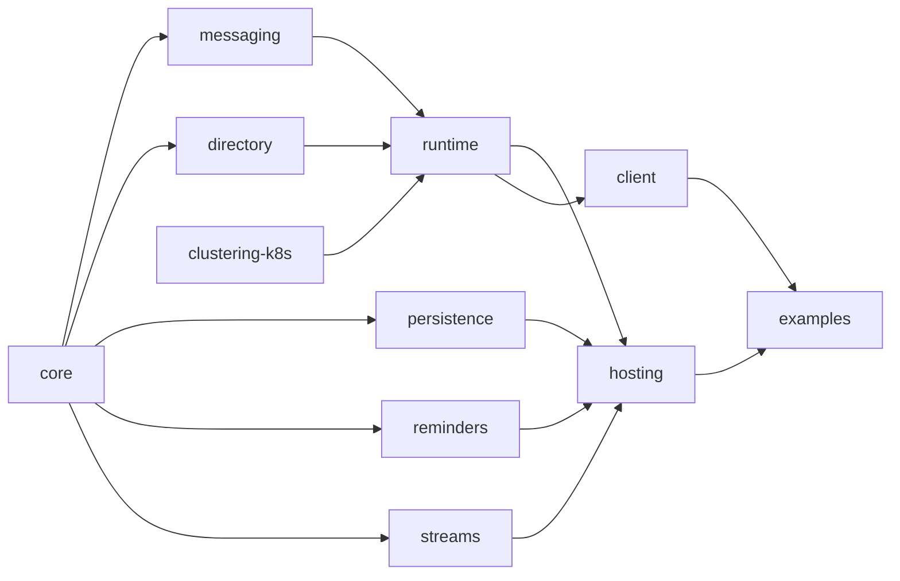

# 12 — Project structure and tooling

How the codebase is organised, built, and tested.

## Monorepo layout

A [pnpm workspace](https://pnpm.io/workspaces) of focused packages with explicit dependencies.
Packages depend inward (abstractions at the centre, hosting at the edge).

```
ts-virtual-actors/
  package.json                 # workspace root
  pnpm-workspace.yaml
  tsconfig.base.json
  docs/
  packages/
    core/                      # abstractions: GrainId, interfaces, decorators, envelope types
    messaging/                 # Transport interface, WebSocket transport, Serializer
    runtime/                   # silo, catalog, turn scheduler, dispatcher, placement
    directory/                 # DHT grain directory + location cache + ring
    clustering-k8s/            # Kubernetes membership service
    persistence/               # GrainStorage interface + redis/postgres/memory providers
    reminders/                 # reminder service + table providers
    streams/                   # StreamProvider interface + redis-streams/memory providers
    client/                    # external client (getGrain, stream pub/sub, gateway connection)
    hosting/                   # silo builder, client builder, health endpoints, K8s glue
  examples/
    thermostat/                # the worked example from docs/11
```

### Dependency direction



`core` has no internal dependencies. `hosting` composes everything into a runnable silo. `client`
depends only on what an external caller needs (proxies, transport, serialization).

## Module conventions

Per the project house style:

- **No `index.ts` barrel files.** Import from explicit module paths
  (`@tsva/core/grain-id`, not `@tsva/core`). This keeps import graphs legible and avoids accidental
  cycles.
- **One primary export per file**, named for the file.
- **Decorators and `Proxy`** are the only "magic"; everything else is plain classes and functions.
- Package names use a scope, e.g. `@tsva/core`, `@tsva/runtime`.

## TypeScript configuration

- `tsconfig.base.json` with `strict: true`, `exactOptionalPropertyTypes`, `noUncheckedIndexedAccess`.
- Decorators: the runtime relies on decorator metadata; configure the chosen decorator mode
  consistently across packages (standard ECMAScript decorators with a metadata shim, or
  `experimentalDecorators` + `emitDecoratorMetadata` — pinned in the base config).
- `moduleResolution: "bundler"` / `"nodenext"` as appropriate; ESM output.
- Project references between packages for fast incremental builds.

## Testing strategy

The project follows **classic (Detroit-school) TDD with sociable tests** — exercise real
collaborators, fake only at true boundaries (the network, Redis, the Kubernetes API, the clock).
Mockist isolation is avoided.

### Test layers

1. **Unit / sociable.** Drive a grain through the real turn scheduler, catalog and in-memory
   providers. Assert on observable behaviour (state, emitted events, responses), not on internal
   method calls. The in-memory persistence/reminder/stream providers and the in-process transport
   exist primarily to make these tests realistic without external infrastructure.
2. **Single-silo integration.** A whole silo in one process using `useStaticMembership` and
   in-memory providers; assert activation, single-threaded turns, reentrancy, timers, reminders and
   streams end-to-end.
3. **Multi-silo integration.** Several silos in one process over the real WebSocket transport and a
   static/membership stub; assert directory lookup/registration races, placement, cross-silo calls,
   and rebalancing when a silo is removed.
4. **Cluster (Kubernetes) tests.** Deploy to kind; assert membership from real EndpointSlices,
   probe-driven failure detection, rolling updates, and Redis-backed durability across pod restarts.
   Run in CI on demand rather than on every commit.

### Determinism aids

- **Injectable clock.** All timers, reminders and timeouts read a `TimeProvider`; tests use a fake
  clock to make scheduling deterministic (mirrors Orleans' `TimeProvider` usage).
- **Deterministic placement** option for tests, so activation locations are predictable.
- **In-process transport** so multi-silo tests need no real sockets when socket behaviour is not
  under test.

### Test doubles vs real

| Collaborator | In sociable/unit tests | In integration |
| --- | --- | --- |
| Turn scheduler, catalog, directory, placement | real | real |
| Persistence / reminders / streams | in-memory provider (real impl) | in-memory or real Redis |
| Transport | in-process | real WebSocket |
| Membership | static list | static, or real K8s in cluster tests |
| Clock | fake | fake or real |

## Lint, format, CI

- ESLint + a formatter (Prettier or Biome) pinned in the root; one config inherited by all packages.
- `markdownlint` and a link checker over `docs/` (see [13](13-roadmap-and-phases.md) verification).
- CI runs: typecheck, lint, unit + single-silo + multi-silo integration on every PR; cluster tests
  on a schedule / label.
- Tooling is installed via the package manager (`pnpm add -D ...`), never by hand-editing
  `package.json`.
